# Architecture Documentation (Arc42)

**Project**: SimpleWebApp  
**Version**: 1.0.0  
**Target Framework**: .NET 8.0 (net8.0)  
**Date**: 2025  
**Generated by**: Arc42 Documentation Generator  
**Source Repository**: `/home/runner/work/net/net`

---

## Table of Contents

1. [Introduction and Goals](#1-introduction-and-goals)
2. [Constraints](#2-constraints)
3. [Context and Scope](#3-context-and-scope)
4. [Solution Strategy](#4-solution-strategy)
5. [Building Block View](#5-building-block-view)
6. [Runtime View](#6-runtime-view)
7. [Deployment View](#7-deployment-view)
8. [Cross-cutting Concepts](#8-cross-cutting-concepts)
9. [Architecture Decisions](#9-architecture-decisions)
10. [Quality Requirements](#10-quality-requirements)
11. [Risks and Technical Debt](#11-risks-and-technical-debt)
12. [Glossary](#12-glossary)

---

## 1. Introduction and Goals

> **Source files**: `README.md`, `SimpleWebApp/Views/Home/About.cshtml`, `SimpleWebApp/Views/Shared/_Layout.cshtml`, `SimpleWebApp/SimpleWebApp.csproj`

### 1.1 Purpose and Business Context

**SimpleWebApp** is a minimal, foundational ASP.NET Core MVC web application built on **.NET 8.0**. It serves as a well-structured starting template demonstrating the canonical Model-View-Controller pattern within the ASP.NET Core ecosystem. The application provides a multi-page web experience with a responsive Bootstrap-based UI and covers the essential structural concerns of a production-ready MVC project: routing, error handling, static asset management, environment-aware configuration, and logging.

The application's About page describes it explicitly as *"A simple .NET web application"*, and its copyright notice dates it to **2020**, establishing it as a long-lived reference project that has been kept current through the .NET 8.0 upgrade.

### 1.2 Goals

| ID  | Goal                          | Description                                                                                        |
|-----|-------------------------------|----------------------------------------------------------------------------------------------------|
| G-1 | **Demonstrate MVC Pattern**   | Provide a clean, minimal example of the ASP.NET Core MVC architectural pattern.                   |
| G-2 | **Responsive Web UI**         | Deliver a mobile-friendly UI using Bootstrap 5 and jQuery for client-side interactivity.           |
| G-3 | **Environment-aware Config**  | Support distinct Development and Production runtime environments with appropriate error handling.   |
| G-4 | **Secure by Default**         | Enforce HTTPS redirection and HSTS in production environments.                                     |
| G-5 | **Extensibility**             | Provide a minimal but well-structured baseline that can be extended with features, services, and data layers. |

### 1.3 Quality Goals

| Priority | Quality Attribute  | Motivation                                                                 |
|----------|--------------------|----------------------------------------------------------------------------|
| 1        | **Simplicity**     | The codebase is intentionally minimal — easy to read, understand, and fork.|
| 2        | **Maintainability**| Standard ASP.NET Core conventions are followed so any .NET developer can immediately navigate the project. |
| 3        | **Security**       | HTTPS + HSTS enforced in production; development exception pages are explicitly disabled in production. |
| 4        | **Reliability**    | Centralised error handling via `/Home/Error` ensures graceful degradation.  |
| 5        | **Performance**    | Static files are served directly by the middleware pipeline; no unnecessary middleware layers. |

### 1.4 Stakeholders

| Stakeholder             | Role / Interest                                                                      |
|-------------------------|--------------------------------------------------------------------------------------|
| **Developers**          | Use this project as a starting point or reference for ASP.NET Core MVC applications. |
| **Architects**          | Validate architectural conventions and ASP.NET Core best practices.                  |
| **End Users**           | Access the web pages rendered by the application (Home, About, Privacy).             |
| **Operations / DevOps** | Deploy, configure, and monitor the application in target environments.               |
| **Security Teams**      | Verify HTTPS enforcement, HSTS configuration, and environment-specific error handling.|

---

## 2. Constraints

> **Source files**: `SimpleWebApp/SimpleWebApp.csproj`, `SimpleWebApp/Startup.cs`, `SimpleWebApp/Properties/launchSettings.json`, `.gitignore`

### 2.1 Technical Constraints

| ID   | Constraint                            | Rationale / Impact                                                                                    |
|------|---------------------------------------|-------------------------------------------------------------------------------------------------------|
| TC-1 | **Target Framework: .NET 8.0**        | The project targets `net8.0` exclusively. It cannot run on .NET Framework or earlier .NET Core versions. |
| TC-2 | **ASP.NET Core MVC**                  | The application uses `AddControllersWithViews()` — the Razor view engine is tightly coupled to the framework. |
| TC-3 | **Explicit Startup Class Pattern**    | The project uses the `Startup.cs` pattern (pre-.NET 6 hosting model) rather than top-level `Program.cs` statements. This works on .NET 8 but is a legacy convention. |
| TC-4 | **No Database / ORM**                 | There is no data layer, Entity Framework, or database dependency. All content is static or view-state driven. |
| TC-5 | **No Authentication Middleware**      | `UseAuthorization()` is registered but no authentication scheme is configured. No login/logout functionality exists. |
| TC-6 | **Client-side Libraries Vendored**    | Bootstrap 5, jQuery, jQuery Validation, and jQuery Validation Unobtrusive are checked into `wwwroot/lib/`, not fetched via CDN or package manager at runtime. |
| TC-7 | **Static Files Must Be in wwwroot**   | The `UseStaticFiles()` middleware serves only content from `wwwroot/`. Content outside this path is not exposed. |

### 2.2 Organisational Constraints

| ID   | Constraint                          | Rationale / Impact                                                                              |
|------|-------------------------------------|-------------------------------------------------------------------------------------------------|
| OC-1 | **GitHub-hosted Source**            | The repository is hosted on GitHub (`/home/runner/work/net/net`), implying CI/CD via GitHub Actions. |
| OC-2 | **Copyright 2020**                  | The footer copyright is hardcoded to 2020, indicating manual maintenance is required to keep it current. |
| OC-3 | **Minimal Dependency Policy**       | No NuGet packages beyond the implicit `Microsoft.NET.Sdk.Web` SDK are declared, keeping the dependency footprint minimal. |

### 2.3 Conventions

| ID   | Convention                       | Description                                                                                   |
|------|----------------------------------|-----------------------------------------------------------------------------------------------|
| CV-1 | **MVC Naming Convention**        | Controllers in `Controllers/`, Models in `Models/`, Views in `Views/{ControllerName}/`.        |
| CV-2 | **Default Route**                | `{controller=Home}/{action=Index}/{id?}` — the application home page is `HomeController.Index`.|
| CV-3 | **Shared Layout**                | All pages use `_Layout.cshtml` defined in `Views/Shared/`, set globally via `_ViewStart.cshtml`.|
| CV-4 | **Environment Variable for Env** | `ASPNETCORE_ENVIRONMENT` controls runtime environment (Development / Production).              |
| CV-5 | **appsettings Layering**         | `appsettings.json` provides base config; `appsettings.Development.json` overrides for dev.     |

---

## 3. Context and Scope

> **Source files**: `SimpleWebApp/Startup.cs`, `SimpleWebApp/Properties/launchSettings.json`, `SimpleWebApp/appsettings.json`, `SimpleWebApp/Views/Shared/_Layout.cshtml`

### 3.1 Business Context

SimpleWebApp is a **server-side rendered web application** that interacts solely with **end users via a web browser**. There are no external system integrations, APIs, or databases. The system boundary is the web application itself, which accepts HTTP/HTTPS requests and returns HTML responses.

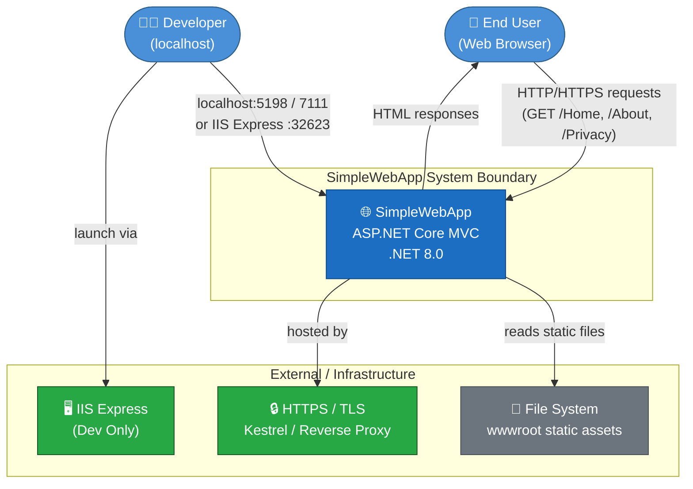
```mermaid
graph TB
    classDef userStyle fill:#4A90D9,stroke:#2C5F8A,color:#fff
    classDef systemStyle fill:#1B6EC2,stroke:#0D4A8A,color:#fff
    classDef externalStyle fill:#6C757D,stroke:#495057,color:#fff
    classDef infraStyle fill:#28A745,stroke:#155724,color:#fff

    User(["👤 End User\n(Web Browser)"]):::userStyle
    Dev(["🧑‍💻 Developer\n(localhost)"]):::userStyle

    subgraph System["SimpleWebApp System Boundary"]
        direction TB
        App["🌐 SimpleWebApp\nASP.NET Core MVC\n.NET 8.0"]:::systemStyle
    end

    subgraph External["External / Infrastructure"]
        direction TB
        IIS["🖥️ IIS Express\n(Dev Only)"]:::infraStyle
        HTTPS["🔒 HTTPS / TLS\nKestrel / Reverse Proxy"]:::infraStyle
        FS["📁 File System\nwwwroot static assets"]:::externalStyle
    end

    User -- "HTTP/HTTPS requests\n(GET /Home, /About, /Privacy)" --> App
    Dev -- "localhost:5198 / 7111\nor IIS Express :32623" --> App
    App -- "HTML responses" --> User
    App -- "reads static files" --> FS
    App -- "hosted by" --> HTTPS
    Dev -- "launch via" --> IIS
```

### 3.2 Technical Context

The application operates within an ASP.NET Core hosting environment, using Kestrel as the default web server in development and a reverse proxy (IIS/nginx/etc.) in production.

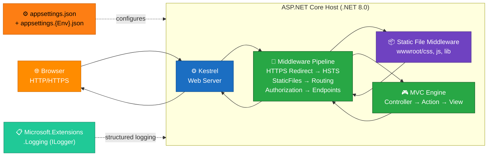
```mermaid
graph LR
    classDef browserStyle fill:#FF8C00,stroke:#CC6600,color:#fff
    classDef kestrelStyle fill:#1B6EC2,stroke:#0D4A8A,color:#fff
    classDef mvcStyle fill:#28A745,stroke:#155724,color:#fff
    classDef staticStyle fill:#6F42C1,stroke:#4B2D89,color:#fff
    classDef configStyle fill:#FD7E14,stroke:#C85A00,color:#000
    classDef logStyle fill:#20C997,stroke:#148A6A,color:#fff

    Browser["🌐 Browser\nHTTP/HTTPS"]:::browserStyle

    subgraph Host["ASP.NET Core Host (.NET 8.0)"]
        direction TB
        Kestrel["⚙️ Kestrel\nWeb Server"]:::kestrelStyle
        Pipeline["🔗 Middleware Pipeline\nHTTPS Redirect → HSTS\nStaticFiles → Routing\nAuthorization → Endpoints"]:::mvcStyle
        MVC["🎮 MVC Engine\nController → Action → View"]:::mvcStyle
        Static["📦 Static File Middleware\nwwwroot/css, js, lib"]:::staticStyle
    end

    Config["⚙️ appsettings.json\n+ appsettings.{Env}.json"]:::configStyle
    Logging["📋 Microsoft.Extensions\n.Logging (ILogger)"]:::logStyle

    Browser --> Kestrel
    Kestrel --> Pipeline
    Pipeline --> Static
    Pipeline --> MVC
    MVC --> Pipeline
    Static --> Pipeline
    Pipeline --> Kestrel
    Kestrel --> Browser
    Config -.->|configures| Host
    Logging -.->|structured logging| Host
```

### 3.3 External Interfaces

| Interface           | Direction       | Protocol   | Description                                                            |
|---------------------|-----------------|------------|------------------------------------------------------------------------|
| Browser ↔ App       | Bidirectional   | HTTP/HTTPS | Standard web browser requests and HTML page responses.                 |
| App → wwwroot       | Outbound (read) | File I/O   | Static files (CSS, JS, images) served directly from the file system.   |
| App → Logging sink  | Outbound        | In-process | Structured log output via `Microsoft.Extensions.Logging`.              |
| App ← Configuration | Inbound (read)  | File I/O   | Runtime config read from `appsettings.json` / environment variables.   |

---

## 4. Solution Strategy

> **Source files**: `SimpleWebApp/Startup.cs`, `SimpleWebApp/Program.cs`, `SimpleWebApp/SimpleWebApp.csproj`

### 4.1 Technology Decisions

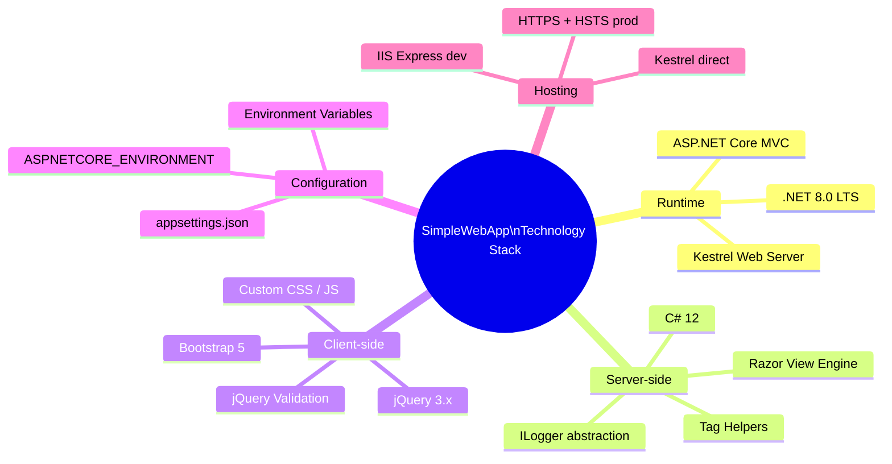
```mermaid
mindmap
  root((SimpleWebApp\nTechnology Stack))
    Runtime
      .NET 8.0 LTS
      ASP.NET Core MVC
      Kestrel Web Server
    Server-side
      C# 12
      Razor View Engine
      Tag Helpers
      ILogger abstraction
    Client-side
      Bootstrap 5
      jQuery 3.x
      jQuery Validation
      Custom CSS / JS
    Configuration
      appsettings.json
      Environment Variables
      ASPNETCORE_ENVIRONMENT
    Hosting
      Kestrel direct
      IIS Express dev
      HTTPS + HSTS prod
```

### 4.2 Architectural Strategy

| Decision                 | Choice Made                             | Rationale                                                                        |
|--------------------------|-----------------------------------------|----------------------------------------------------------------------------------|
| **Presentation Pattern** | Model-View-Controller (MVC)             | Industry-standard server-side rendering pattern; strong separation of concerns.  |
| **Hosting Model**        | `IHostBuilder` with explicit `Startup`  | Familiar, explicit configuration; compatible with .NET 8.0 while using the classic pattern. |
| **Routing**              | Convention-based MVC routing            | Zero-config routing via `{controller}/{action}/{id?}` default pattern.           |
| **Error Handling**       | Environment-aware dual strategy         | Developer exception page in Development; `/Home/Error` handler in Production.    |
| **Security**             | HTTPS redirection + HSTS                | Enforced at middleware level; HSTS ensures browser-level HTTPS enforcement.      |
| **Frontend**             | Server-side rendering (SSR)             | Razor views generate full HTML; no SPA framework needed for a simple app.        |
| **State Management**     | Stateless (no session/db)               | Every request is fully handled by the MVC pipeline without persistent state.     |
| **Dependencies**         | Minimal (SDK-only)                      | No external NuGet packages; reduces supply-chain risk and build complexity.      |

### 4.3 Decomposition Strategy

The application follows a **single-tier MVC decomposition**:
- One controller (`HomeController`) handles all page routes
- Views are co-located with their controller in `Views/Home/`
- Shared UI concerns (layout, validation scripts) live in `Views/Shared/`
- Models are simple POCOs in `Models/`
- Static assets are fully contained in `wwwroot/`

---

## 5. Building Block View

> **Source files**: All `SimpleWebApp/**` files

### 5.1 Level 1 — System Overview

At the highest level, SimpleWebApp is a single deployable unit containing three logical layers: the **web layer** (MVC pipeline), the **presentation layer** (Razor views), and the **static asset layer** (wwwroot).

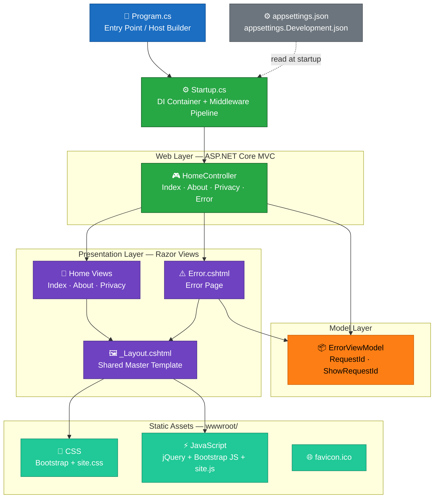
```mermaid
graph TB
    classDef entryStyle fill:#1B6EC2,stroke:#0D4A8A,color:#fff
    classDef webStyle fill:#28A745,stroke:#155724,color:#fff
    classDef viewStyle fill:#6F42C1,stroke:#4B2D89,color:#fff
    classDef modelStyle fill:#FD7E14,stroke:#C85A00,color:#000
    classDef staticStyle fill:#20C997,stroke:#148A6A,color:#fff
    classDef configStyle fill:#6C757D,stroke:#495057,color:#fff

    Program["📌 Program.cs\nEntry Point / Host Builder"]:::entryStyle
    Startup["⚙️ Startup.cs\nDI Container + Middleware Pipeline"]:::webStyle

    subgraph WebLayer["Web Layer — ASP.NET Core MVC"]
        direction TB
        HomeCtrl["🎮 HomeController\nIndex · About · Privacy · Error"]:::webStyle
    end

    subgraph PresentationLayer["Presentation Layer — Razor Views"]
        direction LR
        Layout["🖼️ _Layout.cshtml\nShared Master Template"]:::viewStyle
        HomeViews["📄 Home Views\nIndex · About · Privacy"]:::viewStyle
        ErrorView["⚠️ Error.cshtml\nError Page"]:::viewStyle
    end

    subgraph ModelLayer["Model Layer"]
        ErrorVM["📦 ErrorViewModel\nRequestId · ShowRequestId"]:::modelStyle
    end

    subgraph StaticLayer["Static Assets — wwwroot/"]
        direction LR
        CSS["🎨 CSS\nBootstrap + site.css"]:::staticStyle
        JS["⚡ JavaScript\njQuery + Bootstrap JS + site.js"]:::staticStyle
        Favicon["🌐 favicon.ico"]:::staticStyle
    end

    Config["⚙️ appsettings.json\nappsettings.Development.json"]:::configStyle

    Program --> Startup
    Startup --> HomeCtrl
    HomeCtrl --> HomeViews
    HomeCtrl --> ErrorView
    HomeViews --> Layout
    ErrorView --> Layout
    HomeCtrl --> ErrorVM
    ErrorView --> ErrorVM
    Layout --> CSS
    Layout --> JS
    Config -.->|read at startup| Startup
```

### 5.2 Level 2 — Package / Namespace Structure

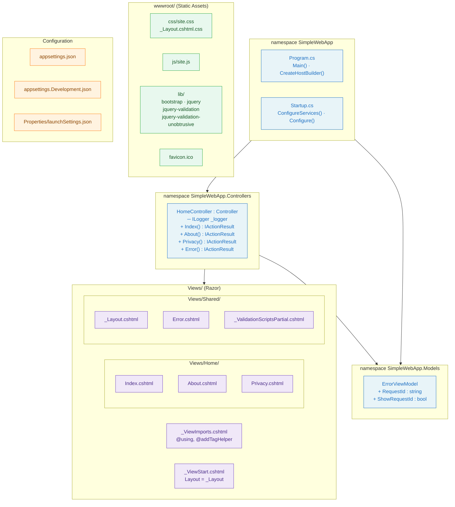
```mermaid
graph TB
    classDef nsStyle fill:#1B6EC2,stroke:#0D4A8A,color:#fff
    classDef classStyle fill:#E8F4F8,stroke:#1B6EC2,color:#1B6EC2
    classDef viewStyle fill:#F0E8F8,stroke:#6F42C1,color:#4B2D89
    classDef staticStyle fill:#E8F8EE,stroke:#28A745,color:#155724
    classDef configStyle fill:#FFF3E0,stroke:#FD7E14,color:#8B4500

    subgraph NS_Root["namespace SimpleWebApp"]
        Program_c["Program.cs\nMain() · CreateHostBuilder()"]:::classStyle
        Startup_c["Startup.cs\nConfigureServices() · Configure()"]:::classStyle
    end

    subgraph NS_Controllers["namespace SimpleWebApp.Controllers"]
        HomeController_c["HomeController : Controller\n─ ILogger _logger\n+ Index() : IActionResult\n+ About() : IActionResult\n+ Privacy() : IActionResult\n+ Error() : IActionResult"]:::classStyle
    end

    subgraph NS_Models["namespace SimpleWebApp.Models"]
        ErrorViewModel_c["ErrorViewModel\n+ RequestId : string\n+ ShowRequestId : bool"]:::classStyle
    end

    subgraph Views_dir["Views/ (Razor)"]
        direction LR
        ViewImports["_ViewImports.cshtml\n@using, @addTagHelper"]:::viewStyle
        ViewStart["_ViewStart.cshtml\nLayout = _Layout"]:::viewStyle
        subgraph HomeV["Views/Home/"]
            IndexV["Index.cshtml"]:::viewStyle
            AboutV["About.cshtml"]:::viewStyle
            PrivacyV["Privacy.cshtml"]:::viewStyle
        end
        subgraph SharedV["Views/Shared/"]
            LayoutV["_Layout.cshtml"]:::viewStyle
            ErrorV["Error.cshtml"]:::viewStyle
            ValScripts["_ValidationScriptsPartial.cshtml"]:::viewStyle
        end
    end

    subgraph wwwroot_dir["wwwroot/ (Static Assets)"]
        direction LR
        CSSFiles["css/site.css\n_Layout.cshtml.css"]:::staticStyle
        JSFiles["js/site.js"]:::staticStyle
        LibFiles["lib/\nbootstrap · jquery\njquery-validation\njquery-validation-unobtrusive"]:::staticStyle
        FaviconF["favicon.ico"]:::staticStyle
    end

    subgraph Config_dir["Configuration"]
        AppSettings["appsettings.json"]:::configStyle
        AppSettingsDev["appsettings.Development.json"]:::configStyle
        LaunchSettings["Properties/launchSettings.json"]:::configStyle
    end

    NS_Root --> NS_Controllers
    NS_Root --> NS_Models
    NS_Controllers --> Views_dir
    NS_Controllers --> NS_Models
```

### 5.3 Level 3 — Detailed Class Diagram

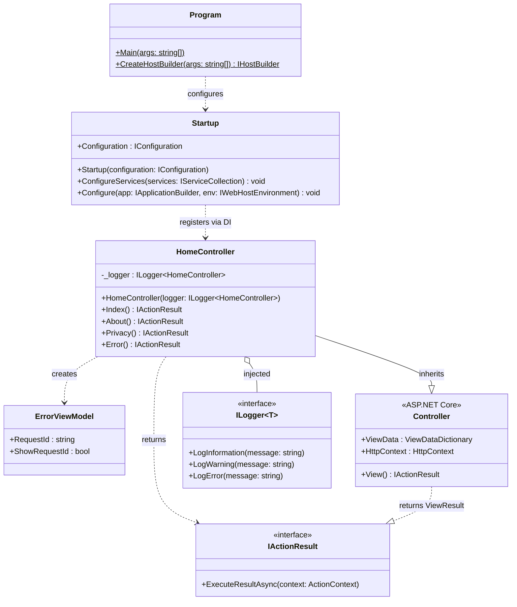
```mermaid
classDiagram
    direction TB

    class Program {
        +Main(args: string[])$
        +CreateHostBuilder(args: string[])$ IHostBuilder
    }

    class Startup {
        +Configuration : IConfiguration
        +Startup(configuration: IConfiguration)
        +ConfigureServices(services: IServiceCollection) void
        +Configure(app: IApplicationBuilder, env: IWebHostEnvironment) void
    }

    class HomeController {
        -_logger : ILogger~HomeController~
        +HomeController(logger: ILogger~HomeController~)
        +Index() IActionResult
        +About() IActionResult
        +Privacy() IActionResult
        +Error() IActionResult
    }

    class ErrorViewModel {
        +RequestId : string
        +ShowRequestId : bool
    }

    class Controller {
        <<ASP.NET Core>>
        +View() IActionResult
        +ViewData : ViewDataDictionary
        +HttpContext : HttpContext
    }

    class ILogger~T~ {
        <<interface>>
        +LogInformation(message: string)
        +LogWarning(message: string)
        +LogError(message: string)
    }

    class IActionResult {
        <<interface>>
        +ExecuteResultAsync(context: ActionContext)
    }

    Program ..> Startup : configures
    Startup ..> HomeController : registers via DI
    HomeController --|> Controller : inherits
    HomeController ..> ErrorViewModel : creates
    HomeController ..> IActionResult : returns
    HomeController o-- ILogger~HomeController~ : injected
    Controller ..|> IActionResult : returns ViewResult
```

### 5.4 Middleware Pipeline Architecture

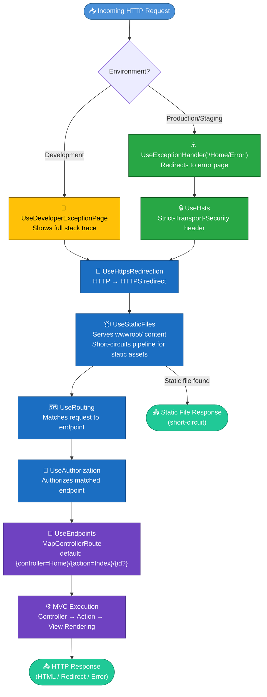
```mermaid
flowchart TD
    classDef requestStyle fill:#4A90D9,stroke:#2C5F8A,color:#fff
    classDef devStyle fill:#FFC107,stroke:#856404,color:#000
    classDef prodStyle fill:#28A745,stroke:#155724,color:#fff
    classDef middlewareStyle fill:#1B6EC2,stroke:#0D4A8A,color:#fff
    classDef mvcStyle fill:#6F42C1,stroke:#4B2D89,color:#fff
    classDef responseStyle fill:#20C997,stroke:#148A6A,color:#fff

    Req(["📥 Incoming HTTP Request"]):::requestStyle

    Req --> EnvCheck{Environment?}

    EnvCheck -- "Development" --> DevExPage["🐛 UseDeveloperExceptionPage\nShows full stack trace"]:::devStyle
    EnvCheck -- "Production/Staging" --> ExHandler["⚠️ UseExceptionHandler('/Home/Error')\nRedirects to error page"]:::prodStyle
    ExHandler --> HSTS["🔒 UseHsts\nStrict-Transport-Security header"]:::prodStyle

    DevExPage --> HttpsRedir["🔁 UseHttpsRedirection\nHTTP → HTTPS redirect"]:::middlewareStyle
    HSTS --> HttpsRedir

    HttpsRedir --> StaticFiles["📦 UseStaticFiles\nServes wwwroot/ content\nShort-circuits pipeline for static assets"]:::middlewareStyle

    StaticFiles --> Routing["🗺️ UseRouting\nMatches request to endpoint"]:::middlewareStyle

    Routing --> Auth["🔐 UseAuthorization\nAuthorizes matched endpoint"]:::middlewareStyle

    Auth --> Endpoints["🎯 UseEndpoints\nMapControllerRoute\ndefault: {controller=Home}/{action=Index}/{id?}"]:::mvcStyle

    Endpoints --> MVCExec["⚙️ MVC Execution\nController → Action → View Rendering"]:::mvcStyle

    MVCExec --> Resp(["📤 HTTP Response\n(HTML / Redirect / Error)"]):::responseStyle

    StaticFiles -- "Static file found" --> StaticResp(["📤 Static File Response\n(short-circuit)"]):::responseStyle
```

---

## 6. Runtime View

> **Source files**: `SimpleWebApp/Controllers/HomeController.cs`, `SimpleWebApp/Startup.cs`, `SimpleWebApp/Views/**`

### 6.1 Scenario 1 — Standard Page Request (Happy Path)

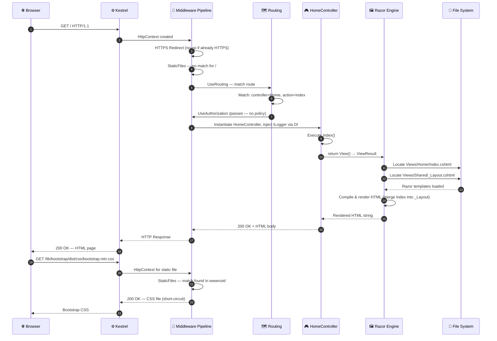
```mermaid
sequenceDiagram
    autonumber
    participant Browser as 🌐 Browser
    participant Kestrel as ⚙️ Kestrel
    participant Pipeline as 🔗 Middleware Pipeline
    participant Router as 🗺️ Routing
    participant HC as 🎮 HomeController
    participant Razor as 🖼️ Razor Engine
    participant FS as 📁 File System

    Browser->>Kestrel: GET / HTTP/1.1
    Kestrel->>Pipeline: HttpContext created
    Pipeline->>Pipeline: HTTPS Redirect (no-op if already HTTPS)
    Pipeline->>Pipeline: StaticFiles — no match for /
    Pipeline->>Router: UseRouting — match route
    Router->>Router: Match: controller=Home, action=Index
    Router->>Pipeline: UseAuthorization (passes — no policy)
    Pipeline->>HC: Instantiate HomeController, inject ILogger via DI
    HC->>HC: Execute Index()
    HC->>Razor: return View() → ViewResult
    Razor->>FS: Locate Views/Home/Index.cshtml
    Razor->>FS: Locate Views/Shared/_Layout.cshtml
    FS-->>Razor: Razor templates loaded
    Razor->>Razor: Compile & render HTML (merge Index into _Layout)
    Razor-->>HC: Rendered HTML string
    HC-->>Pipeline: 200 OK + HTML body
    Pipeline-->>Kestrel: HTTP Response
    Kestrel-->>Browser: 200 OK — HTML page

    Browser->>Kestrel: GET /lib/bootstrap/dist/css/bootstrap.min.css
    Kestrel->>Pipeline: HttpContext for static file
    Pipeline->>Pipeline: StaticFiles — match found in wwwroot/
    Pipeline-->>Kestrel: 200 OK — CSS file (short-circuit)
    Kestrel-->>Browser: Bootstrap CSS
```

### 6.2 Scenario 2 — About Page (ViewData Flow)

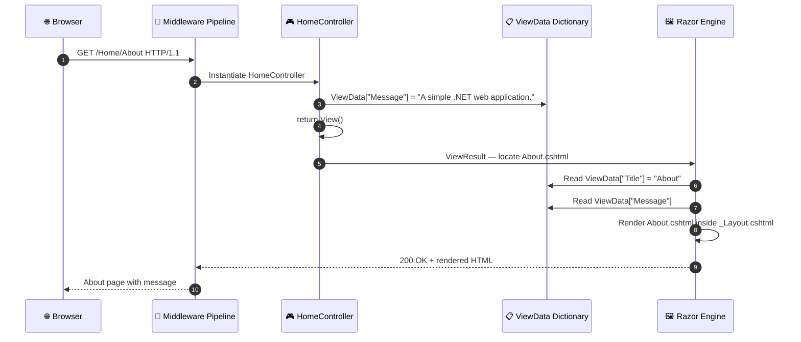
```mermaid
sequenceDiagram
    autonumber
    participant Browser as 🌐 Browser
    participant Pipeline as 🔗 Middleware Pipeline
    participant HC as 🎮 HomeController
    participant ViewData as 📋 ViewData Dictionary
    participant Razor as 🖼️ Razor Engine

    Browser->>Pipeline: GET /Home/About HTTP/1.1
    Pipeline->>HC: Instantiate HomeController
    HC->>ViewData: ViewData["Message"] = "A simple .NET web application."
    HC->>HC: return View()
    HC->>Razor: ViewResult — locate About.cshtml
    Razor->>ViewData: Read ViewData["Title"] = "About"
    Razor->>ViewData: Read ViewData["Message"]
    Razor->>Razor: Render About.cshtml inside _Layout.cshtml
    Razor-->>Pipeline: 200 OK + rendered HTML
    Pipeline-->>Browser: About page with message
```

### 6.3 Scenario 3 — Unhandled Exception (Production Error Flow)

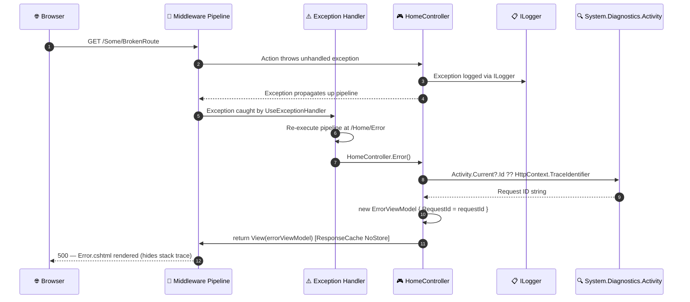
```mermaid
sequenceDiagram
    autonumber
    participant Browser as 🌐 Browser
    participant Pipeline as 🔗 Middleware Pipeline
    participant ExHandler as ⚠️ Exception Handler
    participant HC as 🎮 HomeController
    participant Logger as 📋 ILogger
    participant Activity as 🔍 System.Diagnostics.Activity

    Browser->>Pipeline: GET /Some/BrokenRoute
    Pipeline->>HC: Action throws unhandled exception
    HC->>Logger: Exception logged via ILogger
    HC-->>Pipeline: Exception propagates up pipeline
    Pipeline->>ExHandler: Exception caught by UseExceptionHandler
    ExHandler->>ExHandler: Re-execute pipeline at /Home/Error
    ExHandler->>HC: HomeController.Error()
    HC->>Activity: Activity.Current?.Id ?? HttpContext.TraceIdentifier
    Activity-->>HC: Request ID string
    HC->>HC: new ErrorViewModel { RequestId = requestId }
    HC->>Pipeline: return View(errorViewModel) [ResponseCache NoStore]
    Pipeline-->>Browser: 500 — Error.cshtml rendered (hides stack trace)
```

### 6.4 Scenario 4 — Application Startup Sequence

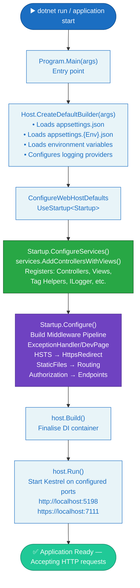
```mermaid
flowchart TD
    classDef startStyle fill:#1B6EC2,stroke:#0D4A8A,color:#fff
    classDef stepStyle fill:#E8F4F8,stroke:#1B6EC2,color:#1B6EC2
    classDef diStyle fill:#28A745,stroke:#155724,color:#fff
    classDef pipeStyle fill:#6F42C1,stroke:#4B2D89,color:#fff
    classDef readyStyle fill:#20C997,stroke:#148A6A,color:#fff

    Start(["▶️ dotnet run / application start"]):::startStyle
    Start --> MainMethod["Program.Main(args)\nEntry point"]:::stepStyle
    MainMethod --> CreateHost["Host.CreateDefaultBuilder(args)\n• Loads appsettings.json\n• Loads appsettings.{Env}.json\n• Loads environment variables\n• Configures logging providers"]:::stepStyle
    CreateHost --> ConfigWebHost["ConfigureWebHostDefaults\nUseStartup&lt;Startup&gt;"]:::stepStyle
    ConfigWebHost --> ConfigServices["Startup.ConfigureServices()\nservices.AddControllersWithViews()\nRegisters: Controllers, Views,\nTag Helpers, ILogger, etc."]:::diStyle
    ConfigServices --> ConfigPipeline["Startup.Configure()\nBuild Middleware Pipeline\nExceptionHandler/DevPage\nHSTS → HttpsRedirect\nStaticFiles → Routing\nAuthorization → Endpoints"]:::pipeStyle
    ConfigPipeline --> BuildHost["host.Build()\nFinalise DI container"]:::stepStyle
    BuildHost --> RunHost["host.Run()\nStart Kestrel on configured ports\nhttp://localhost:5198\nhttps://localhost:7111"]:::stepStyle
    RunHost --> Ready(["✅ Application Ready — Accepting HTTP requests"]):::readyStyle
```

### 6.5 Page Navigation State Machine

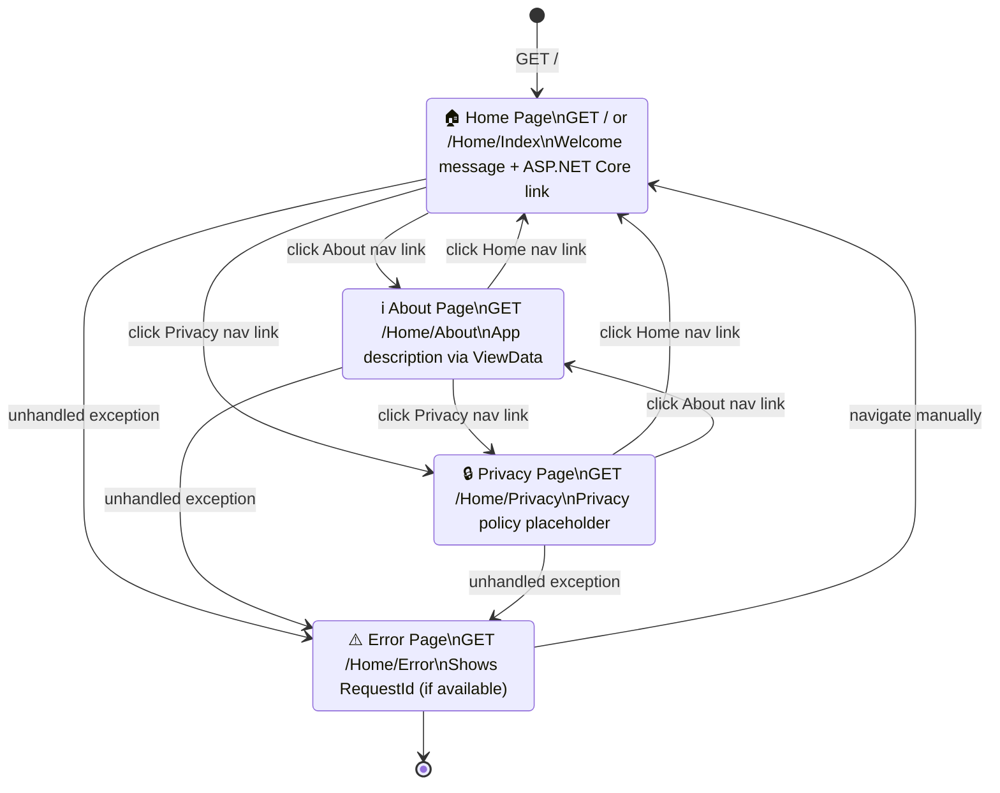
```mermaid
stateDiagram-v2
    [*] --> HomePage : GET /
    HomePage --> AboutPage : click About nav link
    HomePage --> PrivacyPage : click Privacy nav link
    AboutPage --> HomePage : click Home nav link
    AboutPage --> PrivacyPage : click Privacy nav link
    PrivacyPage --> HomePage : click Home nav link
    PrivacyPage --> AboutPage : click About nav link
    HomePage --> ErrorPage : unhandled exception
    AboutPage --> ErrorPage : unhandled exception
    PrivacyPage --> ErrorPage : unhandled exception
    ErrorPage --> HomePage : navigate manually
    ErrorPage --> [*]

    HomePage : 🏠 Home Page\nGET / or /Home/Index\nWelcome message + ASP.NET Core link
    AboutPage : ℹ️ About Page\nGET /Home/About\nApp description via ViewData
    PrivacyPage : 🔒 Privacy Page\nGET /Home/Privacy\nPrivacy policy placeholder
    ErrorPage : ⚠️ Error Page\nGET /Home/Error\nShows RequestId (if available)
```

---

## 7. Deployment View

> **Source files**: `SimpleWebApp/Properties/launchSettings.json`, `SimpleWebApp/appsettings.json`, `SimpleWebApp/Startup.cs`

### 7.1 Development Deployment

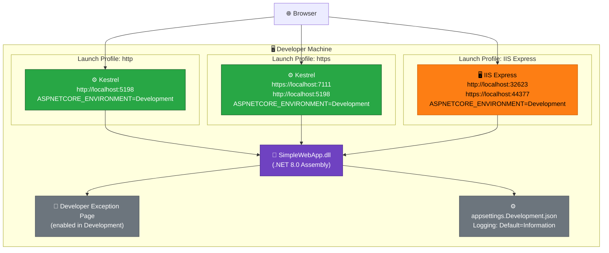
```mermaid
graph TB
    classDef kestrelStyle fill:#28A745,stroke:#155724,color:#fff
    classDef iisStyle fill:#FD7E14,stroke:#C85A00,color:#000
    classDef appStyle fill:#6F42C1,stroke:#4B2D89,color:#fff
    classDef configStyle fill:#6C757D,stroke:#495057,color:#fff

    subgraph DevMachine["🖥️ Developer Machine"]
        subgraph Profile_HTTP["Launch Profile: http"]
            Kestrel_HTTP["⚙️ Kestrel\nhttp://localhost:5198\nASPNETCORE_ENVIRONMENT=Development"]:::kestrelStyle
        end
        subgraph Profile_HTTPS["Launch Profile: https"]
            Kestrel_HTTPS["⚙️ Kestrel\nhttps://localhost:7111\nhttp://localhost:5198\nASPNETCORE_ENVIRONMENT=Development"]:::kestrelStyle
        end
        subgraph Profile_IIS["Launch Profile: IIS Express"]
            IISExpress["🖥️ IIS Express\nhttp://localhost:32623\nhttps://localhost:44377\nASPNETCORE_ENVIRONMENT=Development"]:::iisStyle
        end
        App["🎯 SimpleWebApp.dll\n(.NET 8.0 Assembly)"]:::appStyle
        DevExPage["🐛 Developer Exception Page\n(enabled in Development)"]:::configStyle
        AppSettingsDev["⚙️ appsettings.Development.json\nLogging: Default=Information"]:::configStyle
    end

    Browser["🌐 Browser"]
    Browser --> Kestrel_HTTP
    Browser --> Kestrel_HTTPS
    Browser --> IISExpress
    Kestrel_HTTP --> App
    Kestrel_HTTPS --> App
    IISExpress --> App
    App --> DevExPage
    App --> AppSettingsDev
```

### 7.2 Production Deployment

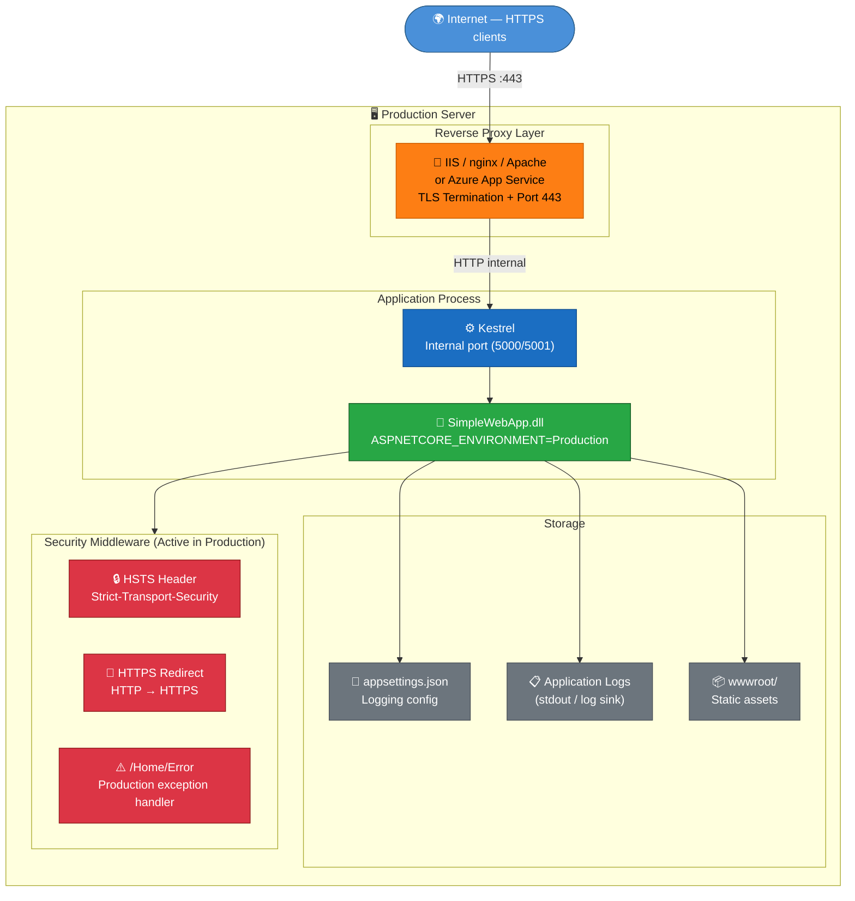
```mermaid
graph TB
    classDef internetStyle fill:#4A90D9,stroke:#2C5F8A,color:#fff
    classDef proxyStyle fill:#FD7E14,stroke:#C85A00,color:#000
    classDef appStyle fill:#28A745,stroke:#155724,color:#fff
    classDef kestrelStyle fill:#1B6EC2,stroke:#0D4A8A,color:#fff
    classDef storageStyle fill:#6C757D,stroke:#495057,color:#fff
    classDef secStyle fill:#DC3545,stroke:#8B1A1A,color:#fff

    Internet(["🌍 Internet — HTTPS clients"]):::internetStyle

    subgraph ProdServer["🖥️ Production Server"]
        subgraph ReverseProxy["Reverse Proxy Layer"]
            Proxy["🔀 IIS / nginx / Apache\nor Azure App Service\nTLS Termination + Port 443"]:::proxyStyle
        end
        subgraph AppProcess["Application Process"]
            Kestrel["⚙️ Kestrel\nInternal port (5000/5001)"]:::kestrelStyle
            App["🎯 SimpleWebApp.dll\nASPNETCORE_ENVIRONMENT=Production"]:::appStyle
        end
        subgraph Storage["Storage"]
            AppSettings["📄 appsettings.json\nLogging config"]:::storageStyle
            Logs["📋 Application Logs\n(stdout / log sink)"]:::storageStyle
            wwwroot["📦 wwwroot/\nStatic assets"]:::storageStyle
        end
        subgraph Security["Security Middleware (Active in Production)"]
            HSTS["🔒 HSTS Header\nStrict-Transport-Security"]:::secStyle
            HttpsRedir["🔁 HTTPS Redirect\nHTTP → HTTPS"]:::secStyle
            ErrHandler["⚠️ /Home/Error\nProduction exception handler"]:::secStyle
        end
    end

    Internet -- "HTTPS :443" --> Proxy
    Proxy -- "HTTP internal" --> Kestrel
    Kestrel --> App
    App --> Security
    App --> AppSettings
    App --> Logs
    App --> wwwroot
```

### 7.3 Infrastructure Requirements

| Requirement               | Minimum                | Recommended                     |
|---------------------------|------------------------|---------------------------------|
| **Runtime**               | .NET 8.0 Runtime       | .NET 8.0 SDK (for build)        |
| **OS**                    | Windows / Linux / macOS| Linux (container-friendly)      |
| **Memory**                | ~64 MB                 | 256 MB+                         |
| **CPU**                   | 1 vCPU                 | 2+ vCPU                         |
| **Storage**               | ~50 MB                 | 200 MB (with logs)              |
| **Network**               | Port 80 / 443          | Behind TLS-terminating proxy    |
| **Environment Variables** | `ASPNETCORE_ENVIRONMENT` | + `ASPNETCORE_URLS`           |

---

## 8. Cross-cutting Concepts

> **Source files**: `SimpleWebApp/Startup.cs`, `SimpleWebApp/Controllers/HomeController.cs`, `SimpleWebApp/Views/Shared/_Layout.cshtml`, `SimpleWebApp/appsettings.json`

### 8.1 Logging

The application uses **`Microsoft.Extensions.Logging`** injected into `HomeController` via constructor injection (`ILogger<HomeController>`).

| Logger Category           | Log Level (Default) | Log Level (aspnetcore) |
|---------------------------|---------------------|------------------------|
| Default (all categories)  | `Information`       | —                      |
| `Microsoft.AspNetCore.*`  | —                   | `Warning`              |

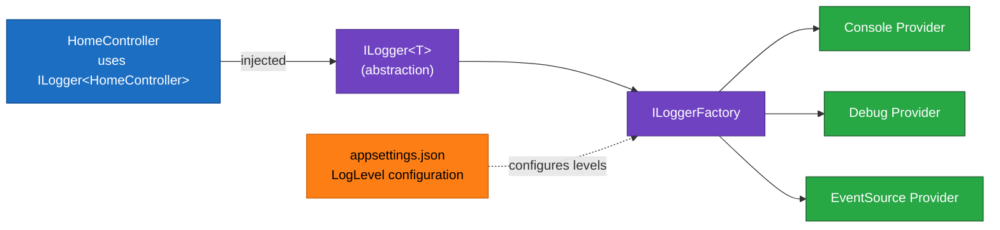
```mermaid
graph LR
    classDef appStyle fill:#1B6EC2,stroke:#0D4A8A,color:#fff
    classDef abstractStyle fill:#6F42C1,stroke:#4B2D89,color:#fff
    classDef providerStyle fill:#28A745,stroke:#155724,color:#fff
    classDef configStyle fill:#FD7E14,stroke:#C85A00,color:#000

    HC["HomeController\nuses ILogger&lt;HomeController&gt;"]:::appStyle
    ILog["ILogger&lt;T&gt;\n(abstraction)"]:::abstractStyle
    LogFact["ILoggerFactory"]:::abstractStyle
    ConsoleP["Console Provider"]:::providerStyle
    DebugP["Debug Provider"]:::providerStyle
    EventP["EventSource Provider"]:::providerStyle
    Config["appsettings.json\nLogLevel configuration"]:::configStyle

    HC -->|injected| ILog
    ILog --> LogFact
    LogFact --> ConsoleP
    LogFact --> DebugP
    LogFact --> EventP
    Config -.->|configures levels| LogFact
```

### 8.2 Configuration Management

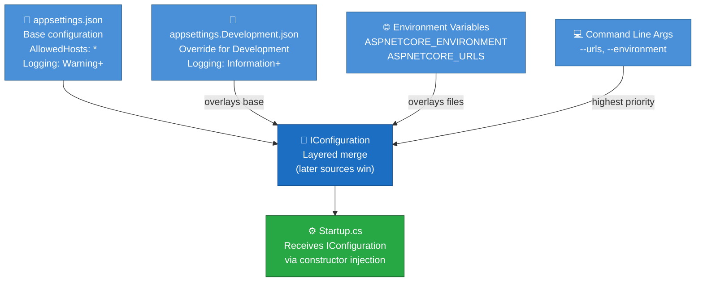
```mermaid
graph TB
    classDef sourceStyle fill:#4A90D9,stroke:#2C5F8A,color:#fff
    classDef mergeStyle fill:#1B6EC2,stroke:#0D4A8A,color:#fff
    classDef appStyle fill:#28A745,stroke:#155724,color:#fff

    Base["📄 appsettings.json\nBase configuration\nAllowedHosts: *\nLogging: Warning+"]:::sourceStyle
    Dev["📄 appsettings.Development.json\nOverride for Development\nLogging: Information+"]:::sourceStyle
    EnvVars["🌐 Environment Variables\nASPNETCORE_ENVIRONMENT\nASPNETCORE_URLS"]:::sourceStyle
    CmdLine["💻 Command Line Args\n--urls, --environment"]:::sourceStyle

    Merge["🔀 IConfiguration\nLayered merge\n(later sources win)"]:::mergeStyle
    App["⚙️ Startup.cs\nReceives IConfiguration\nvia constructor injection"]:::appStyle

    Base --> Merge
    Dev -->|overlays base| Merge
    EnvVars -->|overlays files| Merge
    CmdLine -->|highest priority| Merge
    Merge --> App
```

### 8.3 Error Handling Strategy

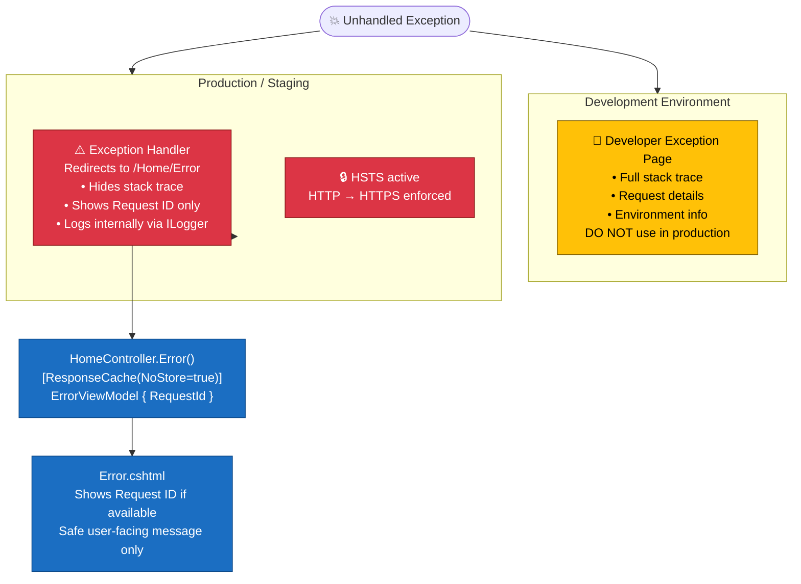
```mermaid
flowchart TB
    classDef devStyle fill:#FFC107,stroke:#856404,color:#000
    classDef prodStyle fill:#DC3545,stroke:#8B1A1A,color:#fff
    classDef sharedStyle fill:#1B6EC2,stroke:#0D4A8A,color:#fff

    Exception(["💥 Unhandled Exception"])

    subgraph Development["Development Environment"]
        DevPage["🐛 Developer Exception Page\n• Full stack trace\n• Request details\n• Environment info\nDO NOT use in production"]:::devStyle
    end

    subgraph Production["Production / Staging"]
        ErrHandler["⚠️ Exception Handler\nRedirects to /Home/Error\n• Hides stack trace\n• Shows Request ID only\n• Logs internally via ILogger"]:::prodStyle
        HSTS_Err["🔒 HSTS active\nHTTP → HTTPS enforced"]:::prodStyle
    end

    ErrorAction["HomeController.Error()\n[ResponseCache(NoStore=true)]\nErrorViewModel { RequestId }"]:::sharedStyle
    ErrorView["Error.cshtml\nShows Request ID if available\nSafe user-facing message only"]:::sharedStyle

    Exception --> Development
    Exception --> Production
    Production --> ErrHandler
    ErrHandler --> ErrorAction
    ErrorAction --> ErrorView
```

### 8.4 Security Concepts

| Concept                       | Implementation                                                                     | Location                            |
|-------------------------------|------------------------------------------------------------------------------------|-------------------------------------|
| **HTTPS Enforcement**         | `app.UseHttpsRedirection()` — redirects all HTTP to HTTPS                          | `Startup.Configure()`               |
| **HSTS**                      | `app.UseHsts()` — sets `Strict-Transport-Security` header in production            | `Startup.Configure()`               |
| **Safe Error Pages**          | Production handler hides internals; `[ResponseCache(NoStore=true)]` on Error action| `Startup.Configure()`, `HomeController` |
| **No Sensitive Data Exposure**| Developer exception page disabled outside Development                              | `Startup.Configure()`               |
| **Anonymous Access Only**     | No authentication configured — all pages publicly accessible                       | `Startup.ConfigureServices()`       |
| **Static File Security**      | Only `wwwroot/` served as static files                                             | `UseStaticFiles()` middleware       |

### 8.5 UI / UX Conventions

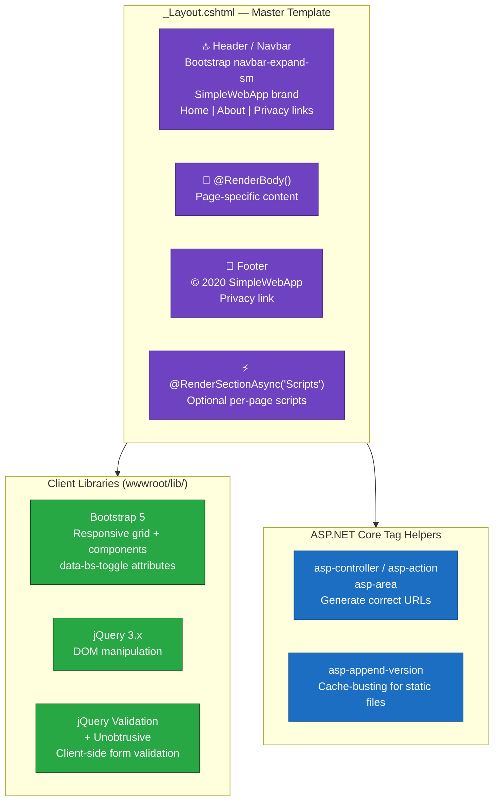
```mermaid
graph TB
    classDef layoutStyle fill:#6F42C1,stroke:#4B2D89,color:#fff
    classDef libStyle fill:#28A745,stroke:#155724,color:#fff
    classDef thStyle fill:#1B6EC2,stroke:#0D4A8A,color:#fff

    subgraph Layout["_Layout.cshtml — Master Template"]
        Header["🔝 Header / Navbar\nBootstrap navbar-expand-sm\nSimpleWebApp brand\nHome | About | Privacy links"]:::layoutStyle
        Body["📄 @RenderBody()\nPage-specific content"]:::layoutStyle
        Footer["🔽 Footer\n© 2020 SimpleWebApp\nPrivacy link"]:::layoutStyle
        ScriptSection["⚡ @RenderSectionAsync('Scripts')\nOptional per-page scripts"]:::layoutStyle
    end

    subgraph Libraries["Client Libraries (wwwroot/lib/)"]
        Bootstrap["Bootstrap 5\nResponsive grid + components\ndata-bs-toggle attributes"]:::libStyle
        jQuery["jQuery 3.x\nDOM manipulation"]:::libStyle
        Validation["jQuery Validation\n+ Unobtrusive\nClient-side form validation"]:::libStyle
    end

    subgraph TagHelpers["ASP.NET Core Tag Helpers"]
        AnchorTH["asp-controller / asp-action\nasp-area\nGenerate correct URLs"]:::thStyle
        VersionTH["asp-append-version\nCache-busting for static files"]:::thStyle
    end

    Layout --> Libraries
    Layout --> TagHelpers
```

### 8.6 Domain Model

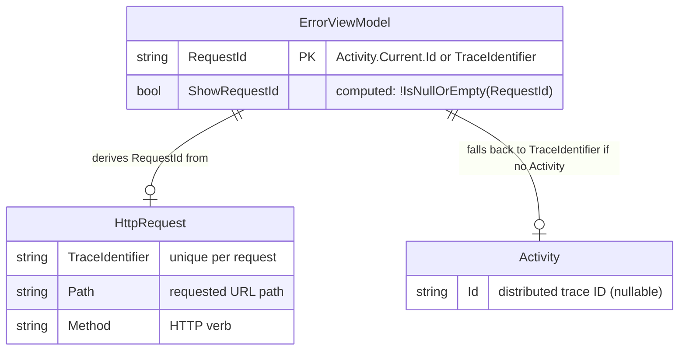
```mermaid
erDiagram
    ErrorViewModel {
        string RequestId PK "Activity.Current.Id or TraceIdentifier"
        bool ShowRequestId "computed: !IsNullOrEmpty(RequestId)"
    }

    HttpRequest {
        string TraceIdentifier "unique per request"
        string Path "requested URL path"
        string Method "HTTP verb"
    }

    Activity {
        string Id "distributed trace ID (nullable)"
    }

    ErrorViewModel ||--o| HttpRequest : "derives RequestId from"
    ErrorViewModel ||--o| Activity : "falls back to TraceIdentifier if no Activity"
```

---

## 9. Architecture Decisions

> **Source files**: `SimpleWebApp/Program.cs`, `SimpleWebApp/Startup.cs`, `SimpleWebApp/SimpleWebApp.csproj`

### ADR-001: ASP.NET Core MVC with Razor Views (Server-Side Rendering)

| Field            | Detail                                                                                          |
|------------------|-------------------------------------------------------------------------------------------------|
| **Status**       | ✅ Accepted                                                                                      |
| **Context**      | The application needs to serve multiple informational web pages with a consistent layout.        |
| **Decision**     | Use ASP.NET Core MVC with Razor view engine for server-side rendering of all pages.             |
| **Rationale**    | SSR with Razor is the standard .NET approach for multi-page applications; it requires no client-side framework, has excellent tooling, and produces fully pre-rendered HTML improving SEO and accessibility. |
| **Consequences** | ✅ Simple mental model, strong .NET ecosystem support. ⚠️ Tighter coupling between server logic and view rendering compared to a SPA + API architecture. |

---

### ADR-002: Explicit Startup Class Pattern (not Minimal API)

| Field            | Detail                                                                                          |
|------------------|-------------------------------------------------------------------------------------------------|
| **Status**       | ✅ Accepted                                                                                      |
| **Context**      | .NET 6+ introduced Minimal API / top-level `Program.cs` patterns. .NET 8.0 is the target.     |
| **Decision**     | Retain the `IHostBuilder` + `Startup.cs` pattern for `ConfigureServices` and `Configure`.      |
| **Rationale**    | The explicit pattern provides clearer separation between service registration and pipeline configuration, which is more readable for teams familiar with pre-.NET 6 patterns. Works identically on .NET 8.0. |
| **Consequences** | ✅ Familiar to experienced ASP.NET Core developers. ⚠️ More boilerplate than Minimal API; future migration would require refactoring. |

---

### ADR-003: No External NuGet Dependencies

| Field            | Detail                                                                                          |
|------------------|-------------------------------------------------------------------------------------------------|
| **Status**       | ✅ Accepted                                                                                      |
| **Context**      | The application is a minimal showcase / template.                                               |
| **Decision**     | Declare no NuGet dependencies beyond the implicit `Microsoft.NET.Sdk.Web` SDK packages.         |
| **Rationale**    | Minimises supply-chain risk, build complexity, and dependency version conflicts.                |
| **Consequences** | ✅ Fast builds, minimal attack surface. ⚠️ Real-world extensions (auth, EF Core) will require adding dependencies. |

---

### ADR-004: Vendor Client-side Libraries into wwwroot/lib

| Field            | Detail                                                                                          |
|------------------|-------------------------------------------------------------------------------------------------|
| **Status**       | ✅ Accepted                                                                                      |
| **Context**      | Bootstrap, jQuery, and validation libraries are needed on the client.                           |
| **Decision**     | Check vendored copies of Bootstrap, jQuery, and jQuery Validation into `wwwroot/lib/`.          |
| **Rationale**    | Eliminates CDN dependency at runtime; works fully offline; no Node.js / npm toolchain required. |
| **Consequences** | ✅ Self-contained deployment, no external CDN dependency. ⚠️ Manual process required to update library versions. |

---

### ADR-005: Environment-Aware Error Handling

| Field            | Detail                                                                                          |
|------------------|-------------------------------------------------------------------------------------------------|
| **Status**       | ✅ Accepted                                                                                      |
| **Context**      | Developers need rich error information; production users must not see internal details.         |
| **Decision**     | Use `UseDeveloperExceptionPage()` in Development; `UseExceptionHandler("/Home/Error")` + `UseHsts()` in Production. |
| **Rationale**    | Security best practice — prevents accidental exposure of stack traces, connection strings, or environment details to end users. |
| **Consequences** | ✅ Secure by default in production. ⚠️ Requires correct `ASPNETCORE_ENVIRONMENT` on each deployment target. |

---

### ADR-006: `[ResponseCache(NoStore=true)]` on Error Action

| Field            | Detail                                                                                          |
|------------------|-------------------------------------------------------------------------------------------------|
| **Status**       | ✅ Accepted                                                                                      |
| **Context**      | The `/Home/Error` endpoint is re-executed after exception handling.                             |
| **Decision**     | Annotate `Error()` with `[ResponseCache(Duration=0, Location=None, NoStore=true)]`.            |
| **Rationale**    | Prevents CDN, browser, or proxy caching of error responses, ensuring each error page reflects the actual current request context (correct Request ID). |
| **Consequences** | ✅ Correct per-request error pages. ⚠️ No performance benefit from caching (acceptable trade-off). |

---

## 10. Quality Requirements

> **Source files**: `SimpleWebApp/Startup.cs`, `SimpleWebApp/Controllers/HomeController.cs`, `SimpleWebApp/appsettings.json`

### 10.1 Quality Tree

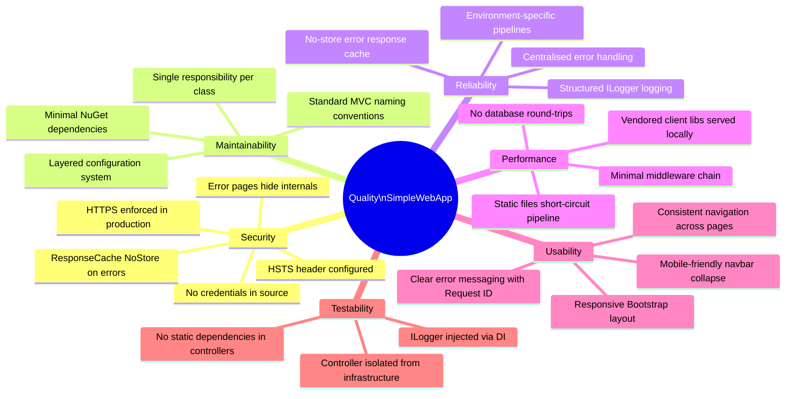
```mermaid
mindmap
  root((Quality\nSimpleWebApp))
    Security
      HTTPS enforced in production
      HSTS header configured
      Error pages hide internals
      No credentials in source
      ResponseCache NoStore on errors
    Maintainability
      Single responsibility per class
      Standard MVC naming conventions
      Minimal NuGet dependencies
      Layered configuration system
    Reliability
      Centralised error handling
      Environment-specific pipelines
      No-store error response cache
      Structured ILogger logging
    Performance
      Static files short-circuit pipeline
      No database round-trips
      Vendored client libs served locally
      Minimal middleware chain
    Usability
      Responsive Bootstrap layout
      Mobile-friendly navbar collapse
      Consistent navigation across pages
      Clear error messaging with Request ID
    Testability
      ILogger injected via DI
      Controller isolated from infrastructure
      No static dependencies in controllers
```

### 10.2 Quality Scenarios

| ID   | Attribute         | Scenario                                                                 | Expected Response                                                      | Met? |
|------|-------------------|--------------------------------------------------------------------------|------------------------------------------------------------------------|------|
| QS-1 | **Security**      | App deployed to production with `ASPNETCORE_ENVIRONMENT=Production`     | HSTS present; HTTP → HTTPS redirect; no stack traces exposed           | ✅   |
| QS-2 | **Security**      | Unhandled exception in production                                        | User sees `/Home/Error` with Request ID only; no internal info         | ✅   |
| QS-3 | **Maintainability**| New developer clones and runs the project                               | `dotnet run` works immediately; conventions are self-evident            | ✅   |
| QS-4 | **Performance**   | Browser requests `bootstrap.min.css`                                     | Served by `UseStaticFiles()`; MVC pipeline not invoked                 | ✅   |
| QS-5 | **Reliability**   | Error action response cached by CDN                                      | `ResponseCache(NoStore=true)` prevents caching; fresh error shown      | ✅   |
| QS-6 | **Usability**     | User views app on mobile device                                          | Navbar collapses to hamburger menu via Bootstrap responsive classes     | ✅   |
| QS-7 | **Testability**   | Developer writes unit test for `HomeController`                          | `ILogger<HomeController>` can be mocked; no static method calls        | ✅   |
| QS-8 | **Reliability**   | `appsettings.json` log level changed                                     | Picked up on next startup without recompilation                         | ✅   |

### 10.3 Code Metrics Summary

| Metric                             | Value          | Assessment                  |
|------------------------------------|----------------|-----------------------------|
| **Lines of C# Code**               | ~75 LOC        | ✅ Minimal and focused       |
| **Number of Controllers**          | 1              | ✅ Appropriate for scope     |
| **Number of Actions**              | 4              | ✅ Single responsibility     |
| **Number of Models**               | 1              | ✅ Lean domain model         |
| **Number of Views**                | 6              | ✅ 4 content + 2 partials    |
| **NuGet Dependencies (explicit)**  | 0              | ✅ No dependency bloat       |
| **External API Integrations**      | 0              | ✅ Self-contained            |
| **Cyclomatic Complexity**          | 1–2 per method | ✅ Very low                  |
| **DI Injection Points**            | 1              | ✅ Correctly uses DI         |
| **Middleware Components**          | 7              | ✅ Minimal pipeline          |

---

## 11. Risks and Technical Debt

> **Source files**: `SimpleWebApp/Startup.cs`, `SimpleWebApp/Views/Shared/_Layout.cshtml`, `SimpleWebApp/SimpleWebApp.csproj`

### 11.1 Risk Register

```mermaid
quadrantChart
    title Risk Assessment Matrix (Likelihood vs Impact)
    x-axis Low Likelihood --> High Likelihood
    y-axis Low Impact --> High Impact
    quadrant-1 Monitor Closely
    quadrant-2 Mitigate Urgently
    quadrant-3 Accept / Low Priority
    quadrant-4 Watch and Plan

    Missing Authentication: [0.70, 0.80]
    No Unit Tests: [0.75, 0.65]
    Outdated Client Libraries: [0.65, 0.55]
    No CI/CD Pipeline: [0.55, 0.55]
    AllowedHosts Unrestricted: [0.60, 0.50]
    No Health Check Endpoint: [0.50, 0.45]
    Legacy Startup Pattern: [0.40, 0.30]
    Hardcoded Copyright Year: [0.80, 0.10]
```

| ID   | Risk                                  | Likelihood | Impact  | Mitigation                                                                      |
|------|---------------------------------------|------------|---------|---------------------------------------------------------------------------------|
| R-01 | **No Authentication/Authorisation**   | High       | High    | Add `AddAuthentication()` + `AddAuthorization()` and `[Authorize]` attributes when needed. |
| R-02 | **No Automated Unit Tests**           | High       | Medium  | Add xUnit test project; use `WebApplicationFactory<Program>` for integration tests. |
| R-03 | **Outdated Vendored Client Libs**     | High       | Medium  | Introduce `libman.json` (Library Manager) or migrate to npm/bundler for updates. |
| R-04 | **No CI/CD Pipeline Definition**      | Medium     | Medium  | Add `.github/workflows/dotnet.yml` for automated build, test, and publish steps. |
| R-05 | **`AllowedHosts: "*"` in Production** | Medium     | Medium  | Restrict `AllowedHosts` to known hostnames in production `appsettings.json`.    |
| R-06 | **No Health Check Endpoint**          | Medium     | Medium  | Add `services.AddHealthChecks()` + `app.MapHealthChecks("/health")`.            |
| R-07 | **Legacy `Startup.cs` Pattern**       | Low        | Low     | Migrate to .NET 6+ top-level `Program.cs` / Minimal API for modern alignment.   |
| R-08 | **Hardcoded Copyright Year (2020)**   | High       | Low     | Replace `© 2020` in `_Layout.cshtml` with `© @DateTime.Now.Year`.              |

### 11.2 Technical Debt Items

```mermaid
graph LR
    classDef highStyle fill:#DC3545,stroke:#8B1A1A,color:#fff
    classDef medStyle fill:#FD7E14,stroke:#C85A00,color:#000
    classDef lowStyle fill:#28A745,stroke:#155724,color:#fff

    subgraph High["🔴 High Priority"]
        TD1["TD-01: No Test Coverage\nZero automated tests\nRisk: Regression on any change"]:::highStyle
        TD2["TD-02: Authentication Absent\nAll routes are public\nRisk: Cannot add protected pages safely"]:::highStyle
    end

    subgraph Medium["🟠 Medium Priority"]
        TD3["TD-03: Vendored Client Libraries\nBootstrap/jQuery not auto-updated\nRisk: Known CVEs in old versions"]:::medStyle
        TD4["TD-04: No CI/CD Definition\nNo automated build pipeline\nRisk: Manual error-prone deployments"]:::medStyle
        TD5["TD-05: AllowedHosts Unrestricted\n'*' allows any hostname\nRisk: Host header injection"]:::medStyle
        TD6["TD-06: No Health Checks\nNo /health endpoint\nRisk: Cannot integrate with orchestrators"]:::medStyle
    end

    subgraph Low["🟢 Low Priority"]
        TD7["TD-07: Hardcoded Copyright 2020\nStale footer year"]:::lowStyle
        TD8["TD-08: Legacy Startup Pattern\nNot using .NET 6+ conventions"]:::lowStyle
    end
```

### 11.3 Recommended Improvement Roadmap

| Sprint | Action                                                | Benefit                                    |
|--------|-------------------------------------------------------|--------------------------------------------|
| 1      | Fix copyright year → `@DateTime.Now.Year`             | Removes trivial but visible tech debt      |
| 1      | Add GitHub Actions CI workflow (build + test)         | Automated quality gate                     |
| 2      | Add xUnit test project with `WebApplicationFactory`   | Regression safety net                      |
| 2      | Replace vendored libs with `libman.json`              | Easier, trackable version updates          |
| 3      | Restrict `AllowedHosts` in production config          | Security hardening                         |
| 3      | Add `AddHealthChecks()` + `/health` endpoint          | Production readiness / K8s support         |
| 4      | Migrate to top-level `Program.cs` pattern             | Modern .NET 6+ conventions alignment       |

---

## 12. Glossary

> Terms extracted from source code, configuration, and framework conventions.

| Term                             | Definition                                                                                                                             |
|----------------------------------|----------------------------------------------------------------------------------------------------------------------------------------|
| **Action**                       | A public method on a Controller class that handles an HTTP request and returns an `IActionResult` (e.g., `ViewResult`, `RedirectResult`). |
| **appsettings.json**             | The primary JSON configuration file for ASP.NET Core applications, read at startup to configure logging and custom settings.            |
| **ASP.NET Core**                 | Microsoft's open-source, cross-platform web framework for building web applications and APIs on .NET.                                  |
| **Bootstrap**                    | A popular open-source CSS/JavaScript framework for responsive, mobile-first web interfaces. Used here at version 5.x.                   |
| **Controller**                   | A class inheriting `Microsoft.AspNetCore.Mvc.Controller` that handles HTTP requests, invokes logic, and returns views or data.          |
| **cshtml**                       | File extension for Razor templates combining C# code with HTML markup to produce dynamic HTML output.                                   |
| **DI / Dependency Injection**    | A pattern where dependencies are provided to a class externally (e.g., `ILogger` injected into `HomeController` via constructor).       |
| **ErrorViewModel**               | A POCO model carrying the `RequestId` string used to correlate an error page with the originating HTTP request in logs.                 |
| **HSTS**                         | HTTP Strict Transport Security — a security policy instructing browsers to access the site over HTTPS only.                             |
| **IActionResult**                | Interface representing the result of an MVC controller action. Common implementations: `ViewResult`, `RedirectResult`, `NotFoundResult`. |
| **IConfiguration**               | ASP.NET Core's abstraction for reading hierarchical configuration from multiple sources.                                                |
| **IHostBuilder**                 | Builder interface in .NET Generic Host used to configure and create an `IHost` (application lifecycle container).                       |
| **ILogger / ILogger\<T\>**       | Microsoft's standard logging abstraction. `ILogger<T>` provides category-scoped logging where `T` is the consuming class.              |
| **IWebHostEnvironment**          | Provides information about the web hosting environment (`IsDevelopment()`, `IsProduction()`, `ContentRootPath`).                        |
| **Kestrel**                      | The cross-platform web server built into ASP.NET Core, used as the default edge server in development.                                  |
| **Layout**                       | A Razor view (`_Layout.cshtml`) acting as a master template into which page content is injected via `@RenderBody()`.                    |
| **Middleware**                   | Components assembled into a pipeline handling HTTP requests/responses in ASP.NET Core. Each can short-circuit or pass the request.      |
| **MVC (Model-View-Controller)**  | Architectural pattern separating concerns into Models (data), Views (presentation), and Controllers (request handling).                 |
| **net8.0**                       | Target framework moniker for .NET 8.0, the 2023 LTS release of Microsoft's cross-platform .NET runtime.                               |
| **NuGet**                        | The package manager for .NET. This project uses zero explicit NuGet packages.                                                          |
| **Razor**                        | ASP.NET Core's server-side templating engine combining C# with HTML using `@` syntax to produce dynamic web pages.                     |
| **RequestId**                    | A unique per-request identifier from `Activity.Current?.Id` (distributed tracing) or `HttpContext.TraceIdentifier` as fallback.        |
| **ResponseCache**                | ASP.NET Core attribute (`[ResponseCache]`) controlling HTTP caching headers. Used with `NoStore=true` on the Error action.              |
| **Route / Routing**              | Matching incoming HTTP request URLs to specific controller actions. Default: `{controller=Home}/{action=Index}/{id?}`.                  |
| **Startup.cs**                   | Conventional class in pre-.NET 6 ASP.NET Core where DI container (`ConfigureServices`) and middleware pipeline (`Configure`) are defined. |
| **Static Files**                 | Files served directly to clients without server-side processing (CSS, JS, images). Placed in `wwwroot/`.                               |
| **Tag Helpers**                  | ASP.NET Core server-side HTML helpers using attributes (`asp-controller`, `asp-action`) to generate correct URLs and form bindings.     |
| **TraceIdentifier**              | A unique string per HTTP request assigned by `HttpContext`, used for request correlation in logs.                                       |
| **ViewData**                     | A `ViewDataDictionary` (key-value store) used to pass data from a Controller action to its Razor view.                                 |
| **ViewResult**                   | An `IActionResult` implementation that renders a Razor view. Returned by `Controller.View()`.                                          |
| **wwwroot**                      | The web root directory from which static files are served. All publicly accessible static assets must reside here.                     |
| **_ViewImports.cshtml**          | Razor file applying `@using` directives and `@addTagHelper` registrations to all views in its directory tree.                          |
| **_ViewStart.cshtml**            | Razor file executing before each view renders; used here to set `Layout = "_Layout"` globally.                                         |

---

*Documentation generated by Arc42 Documentation Generator*  
*Based on source analysis of `/home/runner/work/net/net/SimpleWebApp`*  
*Architecture template: [Arc42](https://arc42.org) — The pragmatic, practical and proven way to document and communicate software architectures*
