# Architecture Documentation (Arc42)

**Project**: SimpleWebApp — ERP App (ERPApp-001 Revive)
**Version**: 1.0.0
**Date**: 2025-01-01
**Generated by**: Arc42 Documentation Generator
**Framework**: ASP.NET Core MVC on .NET 8.0

> **📁 Note**: This file was generated at the repository root. To move it to the intended location
> `docs/arc42/architecture.md`, run: `mkdir -p docs/arc42 && mv ARC42_DOCUMENTATION.md docs/arc42/architecture.md`

---

## Table of Contents

1. [Introduction and Goals](#1-introduction-and-goals)
2. [Architecture Constraints](#2-architecture-constraints)
3. [System Scope and Context](#3-system-scope-and-context)
4. [Solution Strategy](#4-solution-strategy)
5. [Building Block View](#5-building-block-view)
6. [Runtime View](#6-runtime-view)
7. [Deployment View](#7-deployment-view)
8. [Cross-cutting Concepts](#8-cross-cutting-concepts)
9. [Architecture Decisions](#9-architecture-decisions)
10. [Quality Requirements](#10-quality-requirements)
11. [Risks and Technical Debt](#11-risks-and-technical-debt)
12. [Glossary](#12-glossary)

---

## 1. Introduction and Goals

### 1.1 Business Context and Objectives

**SimpleWebApp** is an ASP.NET Core MVC web application developed under the ERP initiative **ERPApp-001 Revive**. It serves as the foundational web front-end for a lightweight ERP (Enterprise Resource Planning) platform, providing a structured, navigable interface for end users.

The application is designed with the following primary objectives:

| Objective | Description |
|-----------|-------------|
| **Web Presence** | Deliver a responsive, browser-accessible user interface for ERP functionality |
| **Platform Foundation** | Establish a clean, extensible MVC architecture that can grow with additional ERP modules |
| **Developer Experience** | Leverage the ASP.NET Core ecosystem for rapid, maintainable feature development |
| **Reliability** | Provide stable request handling with structured error management |
| **Security Baseline** | Enforce HTTPS, HSTS, and standard authorization middleware from the outset |

The current version provides the core navigational scaffold — Home, About, and Privacy pages — with a robust error-handling flow and a shared layout system intended to host future ERP modules.

### 1.2 Quality Goals

The top quality goals for this system, in priority order:

| Priority | Quality Goal | Motivation |
|----------|-------------|------------|
| 1 | **Maintainability** | MVC separation of concerns, Razor views, and dependency injection ensure the system can evolve cleanly |
| 2 | **Security** | HTTPS redirection, HSTS headers, and authorization middleware enforce security at the infrastructure level |
| 3 | **Reliability** | Centralized error handling (`/Home/Error`) with `RequestId` tracing prevents silent failures |
| 4 | **Performance** | Static file serving via CDN-friendly `wwwroot`, response caching attributes, and minimal server-side logic |
| 5 | **Operability** | Structured logging via `Microsoft.Extensions.Logging`, environment-aware configuration (Development/Production) |
| 6 | **Extensibility** | The MVC + DI architecture supports adding controllers, services, and data layers without architectural changes |

### 1.3 Stakeholders

| Stakeholder | Role | Concerns |
|-------------|------|----------|
| **End Users** | Web browser consumers of the ERP UI | Usability, performance, accessibility |
| **ERP Application Developers** | Extend controllers, views, models | Maintainability, code conventions, MVC patterns |
| **DevOps / Operations Team** | Deploy and monitor the application | Deployment topology, logging, configuration management |
| **Security Team** | Review security posture | HTTPS enforcement, HSTS, authentication/authorization strategy |
| **Product Owner (ERPApp-001)** | Drive ERP feature roadmap | Feature completeness, time-to-market, alignment with ERP goals |
| **Architects** | Ensure scalability and design integrity | Technology choices, structural patterns, dependency management |

---

## 2. Architecture Constraints

### 2.1 Technical Constraints

| Constraint | Detail | Source |
|------------|--------|--------|
| **Target Framework** | .NET 8.0 (LTS) | `SimpleWebApp.csproj` → `<TargetFramework>net8.0</TargetFramework>` |
| **Web SDK** | `Microsoft.NET.Sdk.Web` | `SimpleWebApp.csproj` |
| **Runtime Host Model** | Generic Host (`IHostBuilder`) with `CreateDefaultBuilder` | `Program.cs` |
| **Application Model** | ASP.NET Core MVC with Razor Views (`AddControllersWithViews`) | `Startup.cs` |
| **Transport Security** | HTTPS required in production; HSTS enforced via `UseHsts()` | `Startup.cs` |
| **Static Assets** | Must reside under `wwwroot/`; served via `UseStaticFiles()` | `Startup.cs` |
| **Routing Pattern** | Conventional MVC routing: `{controller=Home}/{action=Index}/{id?}` | `Startup.cs` |
| **Front-end Libraries** | Bootstrap 5, jQuery 3.x, jquery-validation, jquery-validation-unobtrusive (bundled locally) | `wwwroot/lib/` |
| **Logging** | ASP.NET Core built-in `ILogger<T>` infrastructure | `appsettings.json`, `HomeController.cs` |
| **Configuration** | `appsettings.json` + `appsettings.{Environment}.json` layered config | `appsettings.json` |

### 2.2 Organizational Constraints

| Constraint | Detail |
|------------|--------|
| **Project Identity** | Assembly name and root namespace fixed as `SimpleWebApp` |
| **Naming Conventions** | .NET/C# standard PascalCase for classes, camelCase for local variables |
| **View Organization** | Views must follow the `/Views/{Controller}/{Action}.cshtml` convention |
| **Error Handling** | All production errors route to `/Home/Error`; developer exception page is environment-gated |
| **Cookie/Privacy Policy** | A Privacy page (`/Home/Privacy`) is mandated as part of the layout navigation |

### 2.3 Conventions and Standards

| Convention | Description |
|------------|-------------|
| **Dependency Injection** | All services registered through ASP.NET Core DI container in `Startup.ConfigureServices` |
| **Environment Awareness** | `IWebHostEnvironment` drives Development vs. Production behaviour |
| **Layout Inheritance** | All views use `_Layout.cshtml` via `_ViewStart.cshtml` |
| **Tag Helpers** | `Microsoft.AspNetCore.Mvc.TagHelpers` enabled globally via `_ViewImports.cshtml` |
| **Response Cache** | Error action explicitly disables caching (`Duration=0, NoStore=true`) |

---

## 3. System Scope and Context

### 3.1 Business Context

SimpleWebApp operates as a self-contained web application serving human end users through standard web browsers. In the ERP roadmap context, it represents the web layer of **ERPApp-001 Revive** — receiving HTTP/HTTPS requests from browsers, processing them through the MVC pipeline, and returning rendered HTML responses.

External entities interacting with the system:

| External Entity | Interaction | Protocol |
|----------------|-------------|----------|
| **End User (Browser)** | Navigates pages, submits requests | HTTPS (HTTP → HTTPS redirect) |
| **IIS / Kestrel (Web Server)** | Hosts and forwards requests to ASP.NET Core pipeline | HTTP/HTTPS |
| **Operating System / .NET Runtime** | Provides hosting environment and BCL | In-process |
| **Configuration Sources** | `appsettings.json`, environment variables, `launchSettings.json` | File system / OS Env |
| **ASP.NET Core Logging Infrastructure** | Receives structured log events from `ILogger<T>` | In-process sink |

### 3.2 C4 Context Diagram

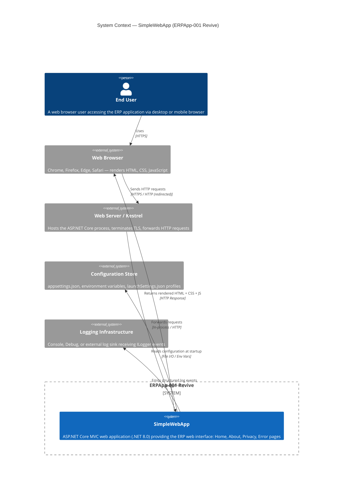

### 3.3 Technical Context

The technical interfaces and channels through which SimpleWebApp interacts with its environment:

| Interface | Direction | Technology | Notes |
|-----------|-----------|------------|-------|
| **HTTP Request** | Inbound | HTTP/1.1, HTTP/2 | Port 5198 (HTTP), 7111 (HTTPS) in development |
| **HTTPS Upgrade** | Internal | HSTS / 301 Redirect | `UseHttpsRedirection()` enforces upgrade |
| **Static File Serving** | Outbound | HTTP | CSS, JS, images from `wwwroot/` |
| **Razor View Rendering** | Internal | Razor Template Engine | Server-side HTML generation |
| **ILogger Sink** | Outbound | Microsoft.Extensions.Logging | Console/Debug in development |
| **Configuration Read** | Inbound | JSON / Env Vars | `appsettings.json` + environment overrides |

---

## 4. Solution Strategy

### 4.1 Technology Decisions

The core technology choices and their rationale:

| Decision | Choice | Rationale |
|----------|--------|-----------|
| **Web Framework** | ASP.NET Core MVC | Industry-standard, cross-platform, strong DI support, large ecosystem; well-suited for ERP-style server-side rendered applications |
| **Runtime** | .NET 8.0 (LTS) | Long-term support release ensures stability and security patches through November 2026; performance improvements over earlier versions |
| **Host Model** | Generic Host (`IHostBuilder`) | Standardized hosting abstraction that supports background services, health checks, and DI; future-proof for adding workers or gRPC |
| **View Engine** | Razor (`.cshtml`) | First-class ASP.NET Core integration; supports Tag Helpers, partial views, layouts, and sections |
| **CSS Framework** | Bootstrap 5 | Responsive grid, pre-built components (navbar, container), minimal custom CSS required |
| **JavaScript** | jQuery + jquery-validation | Low overhead for form validation and DOM manipulation; bundled locally for offline capability |
| **Configuration** | `IConfiguration` (layered JSON + env vars) | Environment-specific overrides without code changes; supports secrets management extension |
| **Logging** | `Microsoft.Extensions.Logging` | Built-in, zero-dependency, provider-agnostic; swap to Serilog/NLog without changing call sites |

### 4.2 Top-Level Architecture Decomposition

The system is decomposed using the standard MVC pattern with ASP.NET Core's middleware pipeline:

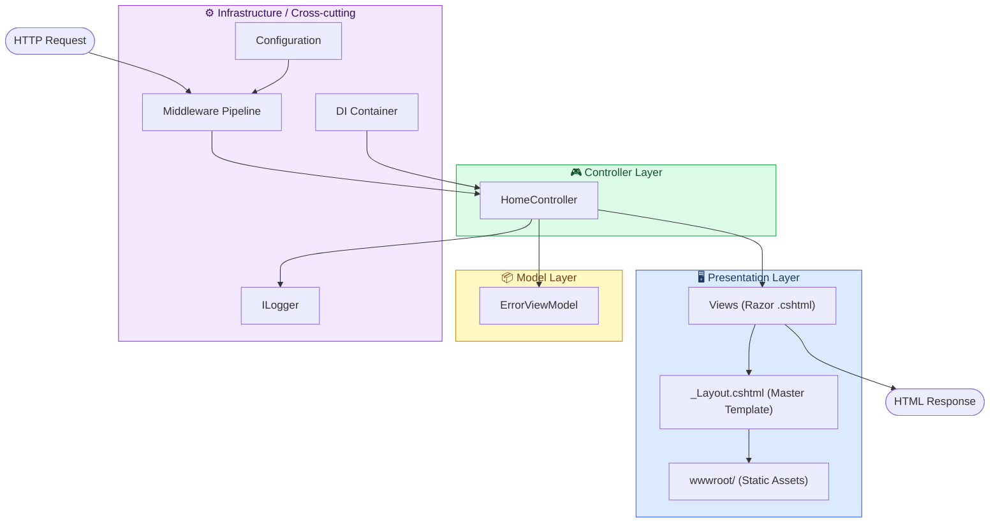

### 4.3 Approaches to Quality Goals

| Quality Goal | Architectural Approach |
|-------------|----------------------|
| **Maintainability** | MVC separation of concerns; each concern (routing, rendering, logic) handled by a distinct layer; DI for loose coupling |
| **Security** | `UseHttpsRedirection()` + `UseHsts()` enforced before routing; `UseAuthorization()` in pipeline for future auth integration |
| **Reliability** | Dual error handling: `UseDeveloperExceptionPage()` in development, `UseExceptionHandler("/Home/Error")` in production; `RequestId` tracing in `ErrorViewModel` |
| **Performance** | Static files served directly by `UseStaticFiles()` before routing (bypasses controller overhead); `asp-append-version` for cache busting |
| **Operability** | `ILogger<HomeController>` injected for action-level logging; `appsettings.{Environment}.json` for environment-specific log levels |
| **Extensibility** | `AddControllersWithViews()` supports adding new controllers without startup changes; conventional routing handles new `{controller}/{action}` pairs automatically |

---

## 5. Building Block View

### 5.1 Level 1 — High-Level System Decomposition

At the highest level, the system consists of three runtime concerns: the **ASP.NET Core Host**, the **MVC Application Core**, and the **Static Content** layer.

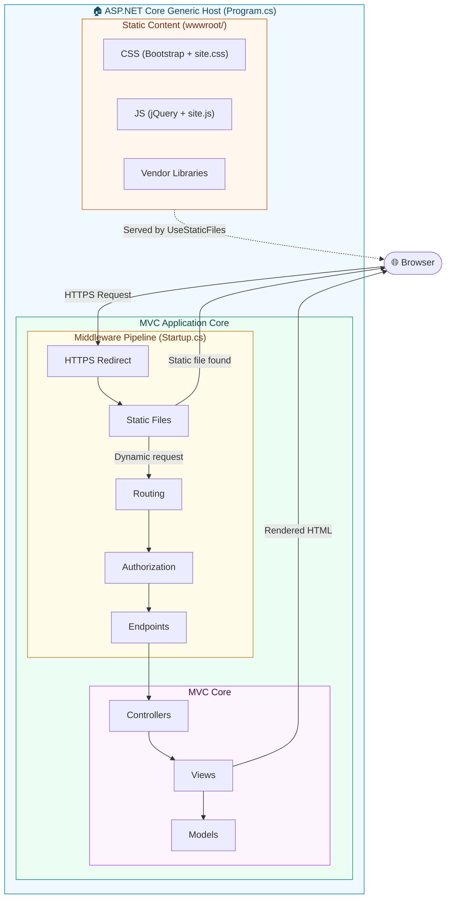

### 5.2 Level 2 — Package and Module Structure

The application's namespace and file structure broken into logical modules:

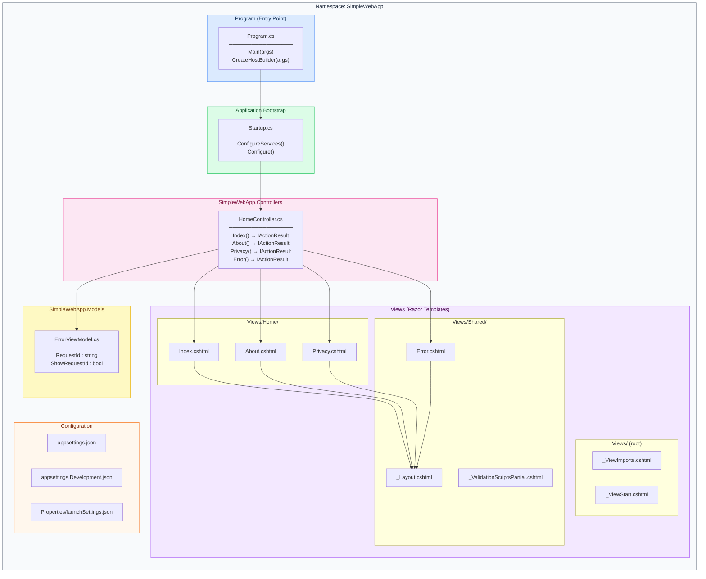

### 5.3 Level 3 — Detailed Class Structure

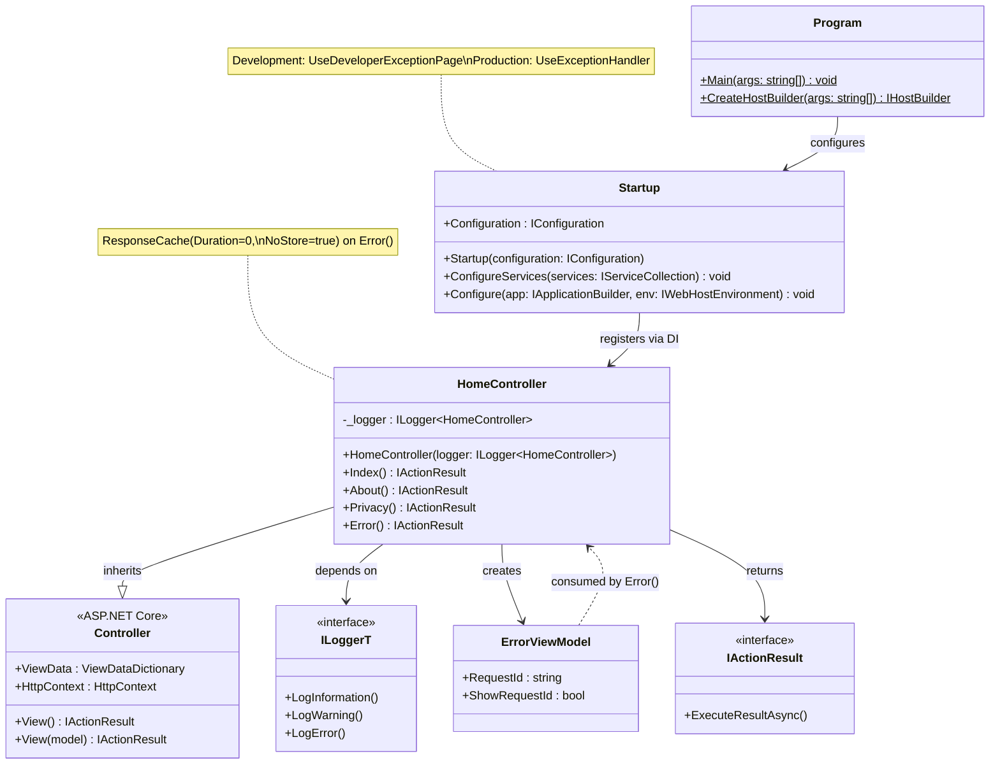

### 5.4 View Component Hierarchy

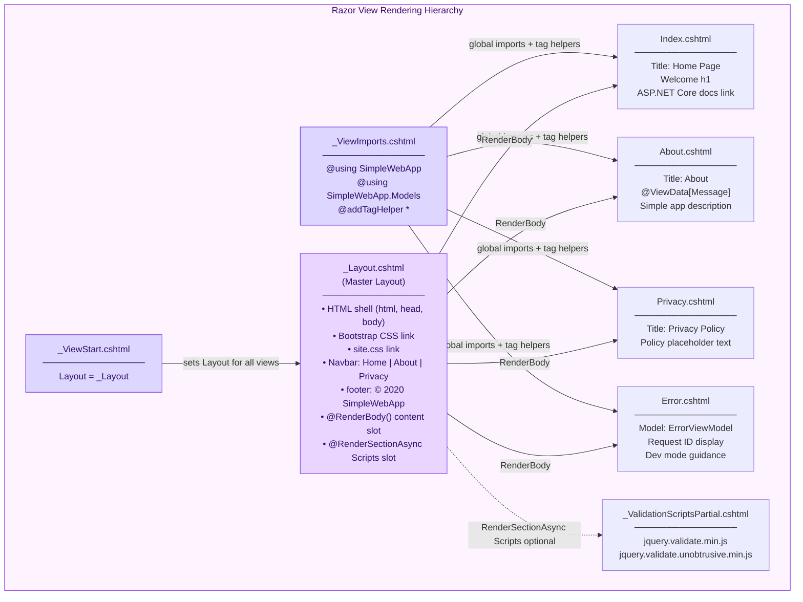

---

## 6. Runtime View

### 6.1 Standard Page Request Lifecycle

The following sequence diagram illustrates the full lifecycle of a successful page request (e.g., `GET /Home/About`):

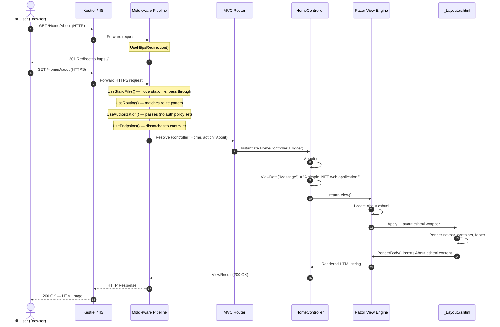

### 6.2 Error Handling Flow

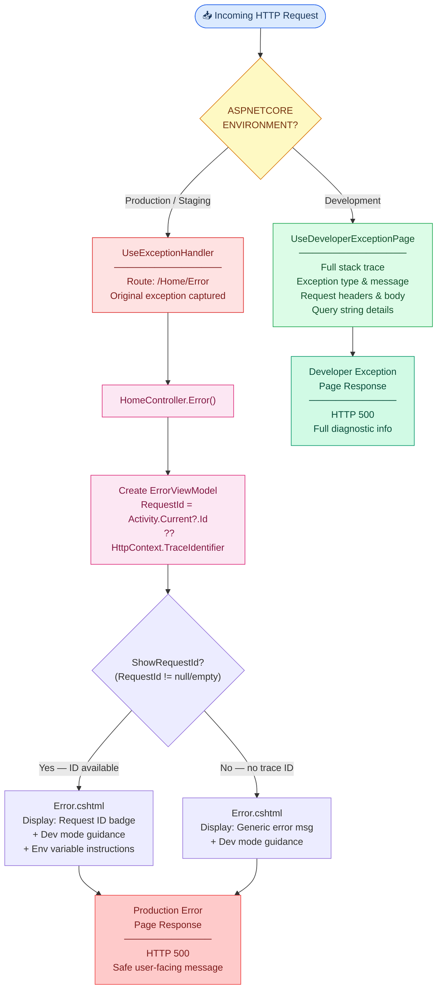

### 6.3 Static Asset Serving Flow

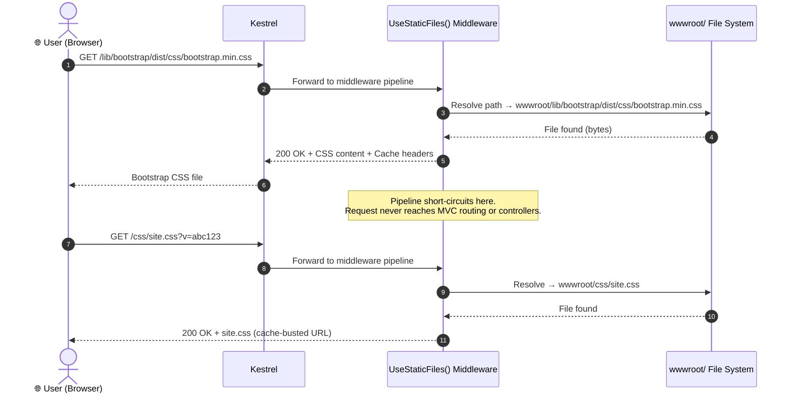

### 6.4 Application Startup Sequence

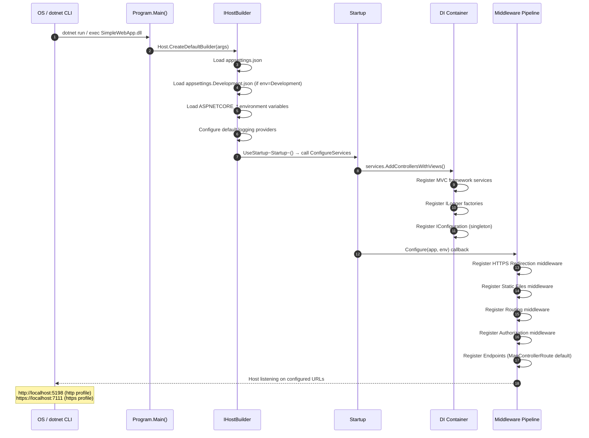

---

## 7. Deployment View

### 7.1 Deployment Topology

SimpleWebApp supports three deployment profiles defined in `Properties/launchSettings.json`:

| Profile | Command | HTTP URL | HTTPS URL | Environment |
|---------|---------|----------|-----------|-------------|
| `http` | `dotnet run` | `http://localhost:5198` | — | Development |
| `https` | `dotnet run` | `http://localhost:5198` | `https://localhost:7111` | Development |
| `IIS Express` | IIS Express | `http://localhost:32623` | `https://localhost:44377` | Development |

### 7.2 Deployment Diagram

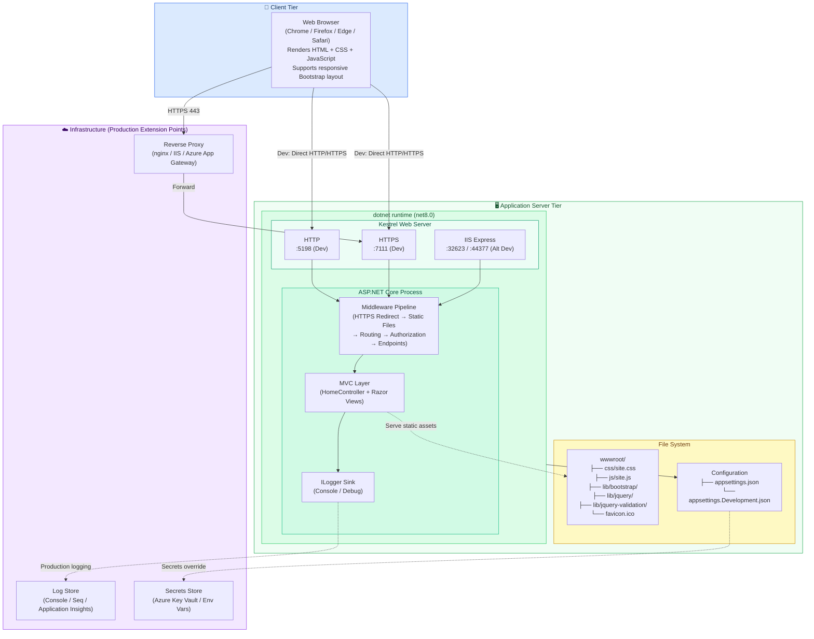

### 7.3 Infrastructure Requirements

| Requirement | Development | Production (Recommended) |
|-------------|-------------|--------------------------|
| **Runtime** | .NET 8.0 SDK | .NET 8.0 Runtime |
| **Web Server** | Kestrel (self-hosted) | Kestrel behind nginx / IIS / Azure App Service |
| **TLS Certificate** | `dotnet dev-certs https --trust` | Valid CA certificate (Let's Encrypt / commercial) |
| **OS** | Windows / Linux / macOS | Linux (recommended for containers) or Windows Server |
| **Memory** | ~50–100 MB (idle) | ~128–256 MB (baseline) |
| **Ports** | 5198 (HTTP), 7111 (HTTPS) | 80 (HTTP redirect), 443 (HTTPS) |
| **File System Access** | Read: `wwwroot/`, `appsettings.json` | Same; secrets via env vars in production |
| **Logging** | Console / Debug output | Structured log sink (Serilog, App Insights, etc.) |

### 7.4 Configuration Resolution Order

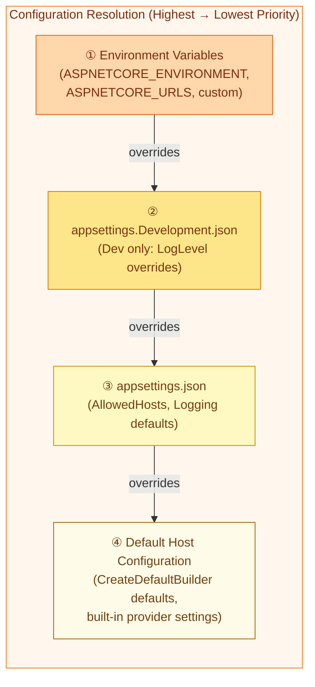

---

## 8. Cross-cutting Concepts

### 8.1 Middleware Pipeline Architecture

The ASP.NET Core middleware pipeline is the central cross-cutting mechanism. Each middleware component in the chain has the opportunity to process the request and response, forming an ordered pipeline:

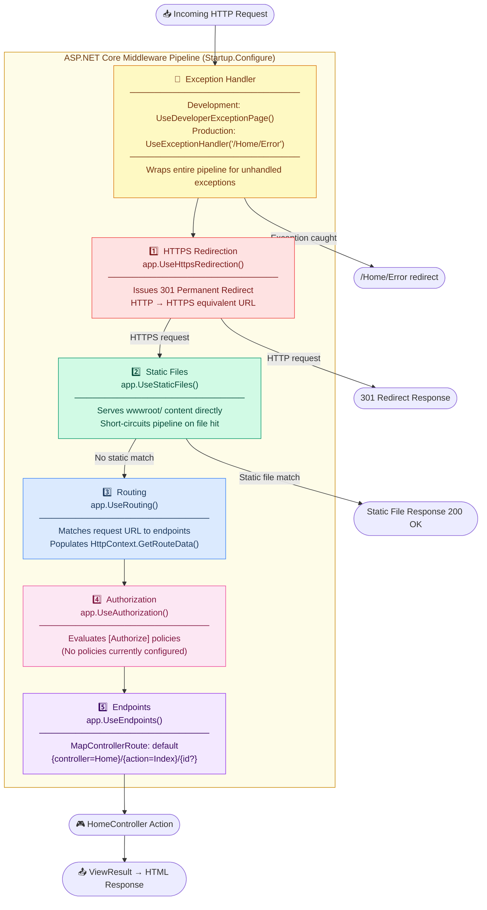

### 8.2 Dependency Injection

ASP.NET Core's built-in DI container is the backbone of all service resolution:

| Service | Lifetime | Registration | Consumer |
|---------|----------|-------------|----------|
| `ILogger<HomeController>` | Transient (per-request) | Auto-registered by `AddControllersWithViews()` | `HomeController` constructor |
| `IConfiguration` | Singleton | Auto-registered by `CreateDefaultBuilder()` | `Startup` constructor |
| `IWebHostEnvironment` | Singleton | Auto-registered by host | `Startup.Configure()` parameter |
| MVC Controllers | Scoped (per-request) | Auto-discovered by `AddControllersWithViews()` | MVC routing system |
| MVC Views (compiled) | Transient | Razor compilation pipeline | MVC action `ViewResult` |

### 8.3 Logging Strategy

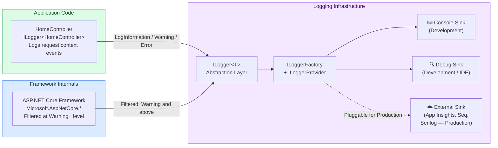

**Configured Log Levels** (from `appsettings.json`):

```json
{
  "Logging": {
    "LogLevel": {
      "Default": "Information",
      "Microsoft.AspNetCore": "Warning"
    }
  },
  "AllowedHosts": "*"
}
```

### 8.4 Error Handling Strategy

| Context | Mechanism | Behaviour |
|---------|-----------|-----------|
| **Development** | `UseDeveloperExceptionPage()` | Full stack trace, exception details, and request information visible in browser response |
| **Production** | `UseExceptionHandler("/Home/Error")` | Redirects silently to `/Home/Error` endpoint; captures `RequestId` for log correlation |
| **Error View** | `Error.cshtml` + `ErrorViewModel` | Shows `RequestId` if available (enables log search); provides guidance on enabling dev mode |
| **Error Caching** | `[ResponseCache(Duration=0, NoStore=true)]` on `Error()` | Prevents caching of error responses — every error is a fresh request |
| **Correlation** | `Activity.Current?.Id ?? HttpContext.TraceIdentifier` | Ties user-visible `RequestId` to server-side log entries |

### 8.5 Security Concepts

| Concept | Implementation | Status |
|---------|---------------|--------|
| **Transport Security** | `UseHttpsRedirection()` + `UseHsts()` in production | ✅ Active |
| **Authorization Middleware** | `UseAuthorization()` registered in pipeline | ✅ Infrastructure ready |
| **Authentication** | `AddAuthentication()` not called; no identity provider | ⚠️ Not yet implemented |
| **Anti-CSRF** | Available via Form Tag Helper (generates hidden tokens) | ✅ Infrastructure ready |
| **Client-side Validation** | jquery-validation + jquery-validation-unobtrusive bundled | ✅ Available |
| **Content Security Policy** | No CSP header configured | ⚠️ Not yet implemented |
| **Sensitive Error Data** | Developer exception page gated by `IsDevelopment()` | ✅ Protected |
| **Host Filtering** | `AllowedHosts: "*"` — all hosts accepted | ⚠️ Should be restricted in production |

### 8.6 Front-end Conventions

| Convention | Detail |
|------------|--------|
| **Layout** | All pages extend `_Layout.cshtml` through `_ViewStart.cshtml` — enforced globally |
| **CSS** | Bootstrap 5 grid + `site.css` custom overrides + scoped component CSS in `_Layout.cshtml.css` |
| **JavaScript** | jQuery from `wwwroot/lib/jquery/`; `site.js` for custom application scripts |
| **Tag Helpers** | Globally enabled in `_ViewImports.cshtml`: `asp-controller`, `asp-action`, `asp-append-version` |
| **ViewData Title** | `ViewData["Title"]` convention used across all views → populates `<title>` in `_Layout.cshtml` |
| **Cache Busting** | `asp-append-version="true"` on CSS/JS links generates fingerprinted query-string URLs |
| **Responsive Design** | Bootstrap `navbar-expand-sm`, `container-fluid`, responsive grid for all viewport sizes |
| **Namespace Imports** | `@using SimpleWebApp` and `@using SimpleWebApp.Models` available in all Razor views |

---

## 9. Architecture Decisions

### ADR-001: ASP.NET Core MVC as Application Framework

| Attribute | Value |
|-----------|-------|
| **Status** | ✅ Accepted |
| **Date** | Project inception |

**Context**: The ERP application requires a server-side rendered web UI with structured routing, templating, and maintainable code organization.

**Decision**: Use ASP.NET Core MVC with Razor Views on .NET 8.0.

**Rationale**:
- Strong separation of concerns via MVC pattern
- First-class Razor templating with layouts, partials, and tag helpers
- Mature DI, logging, and configuration ecosystem
- Cross-platform deployment (Windows / Linux / macOS / containers)
- .NET 8.0 LTS guarantees security support through November 2026

**Consequences**:
- Server-side rendering (not SPA) — full page reloads on navigation
- Razor compilation occurs at build or first-request runtime
- Must follow MVC conventions for routing and view discovery

---

### ADR-002: Generic Host (`IHostBuilder`) over Legacy WebHost

| Attribute | Value |
|-----------|-------|
| **Status** | ✅ Accepted |
| **Date** | Project inception |

**Context**: ASP.NET Core 3.0+ introduced the Generic Host as the preferred hosting model, deprecating `WebHostBuilder` pattern.

**Decision**: Use `Host.CreateDefaultBuilder(args).ConfigureWebHostDefaults(...)` in `Program.cs`.

**Rationale**:
- Supports future addition of background services (`IHostedService`)
- Consistent configuration and DI across web and non-web components
- Standard .NET 5/6/7/8 template pattern
- Enables graceful shutdown, hosted service lifecycle management

**Consequences**:
- Slightly more verbose than the deprecated `WebHost.CreateDefaultBuilder()` pattern
- Ready for worker services, health checks, gRPC services if added later

---

### ADR-003: Conventional MVC Routing over Attribute Routing

| Attribute | Value |
|-----------|-------|
| **Status** | ✅ Accepted |
| **Date** | Project inception |

**Context**: ASP.NET Core supports both conventional routing (centrally defined in `Startup`) and attribute routing (defined on controllers/actions with `[Route]` attributes).

**Decision**: Use conventional routing with the default pattern `{controller=Home}/{action=Index}/{id?}`.

**Rationale**:
- Centralized routing definition — all URL patterns in one place (`Startup.Configure`)
- Default template handles standard MVC URL conventions automatically
- New controllers and actions are discoverable without per-action annotation
- Appropriate for a UI-focused application without complex REST API requirements

**Consequences**:
- All controller/action names are exposed in URLs
- Complex REST APIs added later would benefit from attribute routing

---

### ADR-004: Environment-Gated Error Handling

| Attribute | Value |
|-----------|-------|
| **Status** | ✅ Accepted |
| **Date** | Project inception |

**Context**: Detailed exception information is invaluable during development but a security and information-disclosure risk in production environments.

**Decision**: Conditionally use `UseDeveloperExceptionPage()` in Development and `UseExceptionHandler("/Home/Error")` in all other environments.

**Rationale**:
- Prevents leakage of internal details (stack traces, file paths, connection strings) in production
- Rich diagnostics during development accelerate debugging
- `RequestId` in `ErrorViewModel` enables log correlation without exposing details to end users

**Consequences**:
- Production errors show minimal information to users — comprehensive server-side logging is essential
- `ASPNETCORE_ENVIRONMENT` variable must be correctly set during deployment

---

### ADR-005: Bootstrap 5 Bundled Locally (Not CDN)

| Attribute | Value |
|-----------|-------|
| **Status** | ✅ Accepted |
| **Date** | Project inception |

**Context**: Front-end CSS/JS frameworks can be loaded from public CDNs or bundled with the application in `wwwroot/`.

**Decision**: Bundle Bootstrap, jQuery, and validation libraries locally under `wwwroot/lib/`.

**Rationale**:
- No external CDN dependency — application functions in isolated/air-gapped environments
- Consistent versioning — CDN version changes cannot break the UI unexpectedly
- Simpler Content Security Policy (no external script/style origins required at this stage)

**Consequences**:
- Larger deployment artifact (~500 KB+ for front-end libraries in `wwwroot/lib/`)
- Manual process required when upgrading library versions (use LibMan or npm)
- No cross-site CDN cache benefits (each deployment serves its own copies)

---

### ADR-006: No External Database in Initial Scope

| Attribute | Value |
|-----------|-------|
| **Status** | ✅ Accepted (intentional deferral) |
| **Date** | Project inception |

**Context**: The ERP initiative (ERPApp-001 Revive) ultimately requires data persistence for ERP entities. The current version is the architectural scaffold and UI baseline.

**Decision**: No database driver, ORM, or data access layer is included in this version.

**Rationale**:
- Current scope is restricted to navigation scaffold and UI baseline establishment
- Database integration to be added once domain models and entities are defined
- Avoids premature commitment to a specific ORM (EF Core vs. Dapper vs. direct ADO.NET)

**Consequences**:
- Application is entirely stateless between requests
- Future addition of Entity Framework Core will require `ConfigureServices` changes and database migration scripts
- Domain entities and repository pattern should be designed before adding persistence

---

## 10. Quality Requirements

### 10.1 Quality Tree

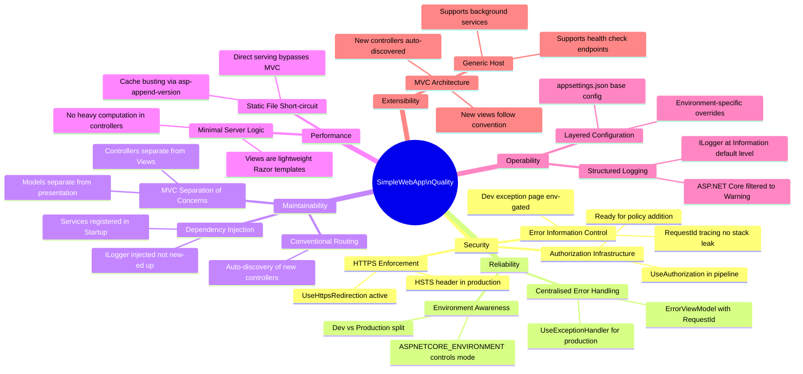

### 10.2 Quality Scenarios

| ID | Quality Attribute | Scenario | Expected Response | Met? |
|----|-----------------|----------|-------------------|------|
| QS-01 | **Security** | An unhandled exception occurs on a production server | User sees generic error page with `RequestId`; no stack trace exposed | ✅ |
| QS-02 | **Security** | A user accesses the application over HTTP | Application issues `301 Permanent Redirect` to HTTPS equivalent | ✅ |
| QS-03 | **Reliability** | The application encounters an error during page render | Error caught by `UseExceptionHandler`; user redirected to `/Home/Error` | ✅ |
| QS-04 | **Performance** | Browser requests `bootstrap.min.css` | `UseStaticFiles()` serves the file directly; MVC pipeline not invoked | ✅ |
| QS-05 | **Maintainability** | Developer adds a new `ProductController` | Convention routing automatically routes `GET /Product/List` without modifying `Startup.cs` | ✅ |
| QS-06 | **Operability** | An error occurs in `HomeController.About()` | `ILogger<HomeController>` emits a structured log event with trace context | ✅ |
| QS-07 | **Extensibility** | Team adds Entity Framework Core | `Startup.ConfigureServices` gains `services.AddDbContext<>()` without architectural refactoring | ✅ |
| QS-08 | **Operability** | DevOps deploys to a new production environment | Setting `ASPNETCORE_ENVIRONMENT=Production` activates HSTS, production error handling | ✅ |
| QS-09 | **Security** | Attacker attempts to access a protected resource | `UseAuthorization()` in pipeline is ready to enforce policies once `[Authorize]` is applied | ⚠️ Partial |
| QS-10 | **Security** | Developer inspects application in production browser | No sensitive details exposed — only `RequestId` if configured | ✅ |

### 10.3 Code Quality Metrics

| Metric | Value | Assessment |
|--------|-------|------------|
| **Lines of Code (C# — application)** | ~100 LOC | ✅ Minimal, appropriate for scaffold |
| **Lines of Code (Razor views)** | ~120 LOC | ✅ Clean, minimal views |
| **Cyclomatic Complexity** | 1–2 per action method | ✅ Very low, single-branch logic |
| **Test Coverage** | 0% (no test project) | ❌ Gap — critical for future features |
| **NuGet Package References** | 0 (all via SDK) | ✅ Zero explicit external packages |
| **Controllers** | 1 (`HomeController`) | ✅ Appropriate for current scope |
| **Controller Actions** | 4 (`Index`, `About`, `Privacy`, `Error`) | ✅ Clear, single-purpose actions |
| **Models** | 1 (`ErrorViewModel`) | ℹ️ Minimal — ERP domain models to be added |
| **Razor Views** | 6 (3 pages + Error + Layout + ValidationPartial) | ✅ Well-organized under Views/ |
| **Middleware Components** | 6 in pipeline | ✅ Standard ASP.NET Core middleware chain |
| **Configuration Files** | 3 (`appsettings.json`, `.Development.json`, `launchSettings.json`) | ✅ Standard layered configuration |

---

## 11. Risks and Technical Debt

### 11.1 Risk Matrix

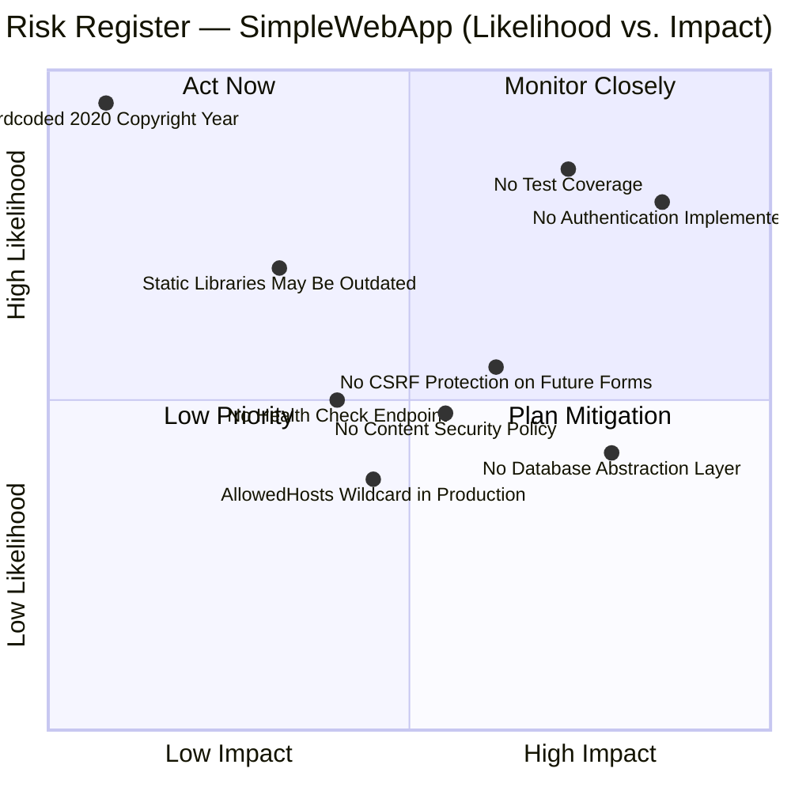

### 11.2 Risk Register

| ID | Risk | Severity | Likelihood | Impact | Mitigation Strategy |
|----|------|----------|------------|--------|---------------------|
| R-01 | **No Authentication / Authorization** — `UseAuthorization()` is in the pipeline but `AddAuthentication()` and identity provider are not configured | 🔴 Critical | High | Any unauthenticated user can access all routes | Add ASP.NET Core Identity or OAuth2/OIDC (e.g., Microsoft Entra ID, Auth0, IdentityServer) before any protected routes go to production |
| R-02 | **No Unit or Integration Tests** — Zero test coverage; no test project (`*.Tests.csproj`) in solution | 🔴 High | High | Regressions undetected; refactoring is high-risk | Add xUnit project; write controller action unit tests; add WebApplicationFactory integration tests |
| R-03 | **No CSRF Protection on Future Forms** — No forms currently, but any future POST forms will need anti-forgery tokens | 🟠 Medium | Medium | CSRF attacks possible once forms are added | Ensure `@Html.AntiForgeryToken()` or Form Tag Helper is used; validate with `[ValidateAntiForgeryToken]` on POST actions |
| R-04 | **No Content Security Policy (CSP)** — No HTTP security headers beyond HSTS configured | 🟠 Medium | Medium | Elevated XSS risk without CSP header | Add security headers middleware (`NWebSec` or custom) emitting CSP, `X-Frame-Options`, `X-Content-Type-Options` |
| R-05 | **Static Libraries Potentially Outdated** — Bootstrap, jQuery versions in `wwwroot/lib/` may fall behind security patches | 🟡 Low-Medium | High | Known CVEs in outdated client-side libraries | Adopt LibMan or npm for library management; schedule quarterly version reviews |
| R-06 | **No Database / Data Persistence** — Application is stateless; ERP functionality requires persistent data | 🔴 High | Certain (planned gap) | Core ERP features cannot be built without persistence | Plan Entity Framework Core integration with domain entity design and migration strategy |
| R-07 | **AllowedHosts: `"*"` in Production** — No host filtering in `appsettings.json` | 🟡 Low | Low | HTTP Host header injection / cache poisoning risk | Set `AllowedHosts` to specific FQDN in production `appsettings.json` (e.g., `"erp.company.com"`) |
| R-08 | **Hardcoded Copyright Year (2020)** — `_Layout.cshtml` footer: `© 2020 - SimpleWebApp` | 🟢 Low | Certain | Cosmetic issue: outdated branding | Replace with `&copy; @DateTime.Now.Year - SimpleWebApp` |
| R-09 | **No Health Check Endpoint** — No `/health` endpoint for load balancer / orchestrator probes | 🟡 Low-Medium | Medium | Load balancers cannot determine application readiness | Add `AddHealthChecks()` in `ConfigureServices` and `MapHealthChecks("/health")` in `UseEndpoints` |

### 11.3 Technical Debt Register

| ID | Debt Item | Category | Effort | Priority | Recommended Action |
|----|-----------|----------|--------|----------|--------------------|
| TD-01 | Add xUnit test project with controller unit tests and WebApplicationFactory integration tests | Testing | Medium | 🔴 High | Create `SimpleWebApp.Tests/` project; target 80%+ coverage of controller actions |
| TD-02 | Implement ASP.NET Core Identity or external OIDC authentication | Security | High | 🔴 High | Define user story requirements → select provider → implement in `Startup` |
| TD-03 | Add Entity Framework Core with `DbContext`, domain entities, and migration strategy for ERP data | Architecture | High | 🔴 High | Design domain model → scaffold EF Core → implement repository pattern |
| TD-04 | Configure `AllowedHosts` with specific production hostnames | Security | Very Low | 🟠 Medium | Update production `appsettings.json`; add environment-specific override |
| TD-05 | Add HTTP security headers middleware (CSP, X-Frame-Options, HSTS preload) | Security | Low | 🟠 Medium | Integrate `NWebSec` package or custom middleware; define CSP policy |
| TD-06 | Upgrade front-end libraries to latest stable (Bootstrap, jQuery) | Maintenance | Low | 🟠 Medium | Use LibMan (`libman.json`) or npm to manage and pin versions |
| TD-07 | Replace hardcoded `© 2020` with dynamic year in `_Layout.cshtml` footer | Quality | Very Low | 🟡 Low | One-line change: `&copy; @DateTime.Now.Year - SimpleWebApp` |
| TD-08 | Add health check endpoint (`/health`) for orchestration compatibility | Operability | Low | 🟠 Medium | `services.AddHealthChecks()` + `endpoints.MapHealthChecks("/health")` |
| TD-09 | Configure Serilog or structured logging provider for production observability | Operability | Medium | 🟠 Medium | Add Serilog NuGet packages; configure sinks (Console structured, Seq, Application Insights) |
| TD-10 | Add Swagger/OpenAPI documentation if REST API endpoints are introduced | Documentation | Low | 🟡 Low | Add `Swashbuckle.AspNetCore`; register `AddSwaggerGen` and `UseSwaggerUI` |

---

## 12. Glossary

| Term | Definition |
|------|-----------|
| **ASP.NET Core** | Microsoft's open-source, cross-platform web framework for building web applications and APIs on .NET |
| **MVC (Model-View-Controller)** | Architectural pattern separating an application into three connected components: Model (data/business logic), View (UI presentation), Controller (request handling) |
| **Razor** | Microsoft's server-side markup language for embedding C# code in HTML templates (`.cshtml` files); used for server-rendered HTML generation |
| **Middleware** | Software components assembled into a linear processing pipeline in ASP.NET Core; each component can process HTTP requests and responses in sequence |
| **Kestrel** | ASP.NET Core's built-in, high-performance, cross-platform HTTP server; used directly in development and behind a reverse proxy in production |
| **IHostBuilder** | The .NET Generic Host builder interface used in `Program.cs` to configure services, configuration providers, and start the application host |
| **Startup** | The convention-based class (`Startup.cs`) that configures the DI container (`ConfigureServices`) and HTTP middleware pipeline (`Configure`) |
| **DI (Dependency Injection)** | Design pattern where dependencies are provided to a class rather than created by it; ASP.NET Core's built-in DI container manages all service lifetimes |
| **ILogger\<T\>** | Generic logging interface from `Microsoft.Extensions.Logging`; injected into controllers and services; provider-agnostic logging abstraction |
| **HSTS** | HTTP Strict Transport Security — a policy header instructing browsers to only contact this server over HTTPS for a specified duration |
| **HTTPS Redirection** | ASP.NET Core middleware (`UseHttpsRedirection()`) that issues HTTP 301 redirects, upgrading insecure connections to HTTPS |
| **Static Files Middleware** | `UseStaticFiles()` middleware that serves files from `wwwroot/` directly without invoking MVC routing; short-circuits the pipeline on match |
| **Tag Helpers** | C#-backed HTML element attributes in Razor views (e.g., `asp-controller`, `asp-action`, `asp-append-version`) that generate correct HTML at server render time |
| **ViewData** | A `ViewDataDictionary` instance for passing loosely-typed data from a controller action to its corresponding Razor view |
| **ErrorViewModel** | A simple POCO model class carrying `RequestId` (string) and `ShowRequestId` (bool) to the Error Razor view for diagnostic display |
| **RequestId** | A unique identifier per HTTP request sourced from `Activity.Current?.Id` or `HttpContext.TraceIdentifier`; used to correlate user-visible errors with server log entries |
| **IActionResult** | Interface representing the result of a controller action; concrete implementations include `ViewResult`, `RedirectResult`, `JsonResult`, `StatusCodeResult` |
| **Bootstrap** | A popular open-source CSS/JS framework providing responsive grid layout, pre-built UI components (navbar, buttons, forms), and utility classes |
| **jQuery** | A widely-used JavaScript library simplifying DOM manipulation, event handling, AJAX requests, and cross-browser compatibility |
| **jquery-validation** | A jQuery plugin providing client-side HTML form validation; paired with `jquery-validation-unobtrusive` for ASP.NET Core Data Annotations integration |
| **wwwroot** | The conventional ASP.NET Core directory for publicly accessible static web assets; only contents of `wwwroot/` are served by `UseStaticFiles()` |
| **appsettings.json** | The primary JSON configuration file for ASP.NET Core; supports environment-specific override files (`appsettings.{Environment}.json`) |
| **launchSettings.json** | Developer-only configuration defining local launch profiles, URLs, and environment variables; not deployed to production |
| **ERP (Enterprise Resource Planning)** | Business management software integrating core organizational processes (finance, HR, supply chain, operations) into a unified system |
| **ERPApp-001 Revive** | The internal ERP initiative identifier under which SimpleWebApp is being developed as the foundational web application |
| **Conventional Routing** | ASP.NET Core routing strategy where URL patterns are defined centrally in `Startup.cs` via `MapControllerRoute`, applied to all matching controllers |
| **IWebHostEnvironment** | ASP.NET Core interface providing the current hosting environment name (`Development`, `Staging`, `Production`) and content root path |
| **Anti-forgery Token** | A security token embedded in HTML forms to prevent Cross-Site Request Forgery (CSRF) attacks; validated on POST by `[ValidateAntiForgeryToken]` |
| **CSP (Content Security Policy)** | An HTTP response header that instructs browsers to restrict the origins from which scripts, styles, images, and other resources may be loaded |
| **Generic Host** | The .NET hosting abstraction (`IHost` / `IHostBuilder`) introduced in .NET Core 3.0 that manages application lifetime, configuration, and DI for any .NET application type |
| **Response Caching** | HTTP caching control; the `[ResponseCache]` attribute on controller actions sets `Cache-Control` headers on HTTP responses |
| **LibMan** | Microsoft's client-side library management tool for ASP.NET Core projects; manages front-end library downloads into `wwwroot/lib/` |

---

*Documentation generated by Arc42 Documentation Generator*  
*Source project: SimpleWebApp — `/home/runner/work/net/net/SimpleWebApp`*  
*Arc42 Template Version: 8.x | .NET 8.0 (net8.0) | ASP.NET Core MVC*  
*All diagrams rendered using Mermaid.js — embed in any Mermaid-compatible Markdown renderer*
