# Architecture Documentation (Arc42)

**Project**: SimpleWebApp  
**Version**: 1.0.0  
**Date**: 2025-01-01  
**Framework**: ASP.NET Core MVC · .NET 8.0  
**Generated by**: Arc42 Documentation Generator

---

## Table of Contents

1. [Introduction and Goals](#1-introduction-and-goals)
2. [Architecture Constraints](#2-architecture-constraints)
3. [System Scope and Context](#3-system-scope-and-context)
4. [Solution Strategy](#4-solution-strategy)
5. [Building Block View](#5-building-block-view)
6. [Runtime View](#6-runtime-view)
7. [Deployment View](#7-deployment-view)
8. [Crosscutting Concepts](#8-crosscutting-concepts)
9. [Architecture Decisions](#9-architecture-decisions)
10. [Quality Requirements](#10-quality-requirements)
11. [Risks and Technical Debt](#11-risks-and-technical-debt)
12. [Glossary](#12-glossary)

---

## 1. Introduction and Goals

### 1.1 Requirements Overview

**SimpleWebApp** is a minimal, educational ASP.NET Core MVC web application built on .NET 8.0. It demonstrates the canonical project structure and startup conventions of the ASP.NET Core MVC framework, providing a clean baseline from which more complex features can be incrementally added.

The application serves the following high-level purposes:

| # | Goal | Description |
|---|------|-------------|
| G-1 | **Demonstrate MVC structure** | Show the controller–model–view separation pattern in ASP.NET Core |
| G-2 | **Provide a working baseline** | Offer a runnable, well-structured starting point for .NET web development |
| G-3 | **Illustrate middleware pipeline** | Showcase how ASP.NET Core middleware is composed in `Startup.Configure` |
| G-4 | **Support multi-environment configuration** | Distinguish Development vs. Production behaviour through environment-specific settings |
| G-5 | **Deliver static content** | Serve Bootstrap-styled HTML pages with client-side JavaScript |

### 1.2 Quality Goals

The following top-level quality goals drive architectural decisions (ordered by priority):

| Priority | Quality Goal | Motivation |
|----------|-------------|------------|
| 1 | **Simplicity** | Minimal codebase ensures readability and fast onboarding |
| 2 | **Maintainability** | Conventional MVC structure follows ASP.NET Core community norms |
| 3 | **Security** | HTTPS redirection and HSTS enforce transport-layer security in production |
| 4 | **Reliability** | Centralised error handling prevents unhandled exception leakage to users |
| 5 | **Portability** | Targets .NET 8.0, which runs on Windows, Linux, and macOS |

### 1.3 Stakeholders

| Role | Concern | Expectation |
|------|---------|-------------|
| **Developer** | Understand the project structure and extend the application | Clear conventions, working local dev setup |
| **Architect** | Validate that the pattern is sound and extensible | Separation of concerns, no anti-patterns |
| **DevOps / Ops** | Deploy and operate the application | Single deployable artefact, environment-specific config |
| **End User** | Browse content pages | Fast, error-free page loads over HTTPS |
| **Security Reviewer** | Ensure safe defaults | HTTPS enforcement, no exposed developer details in production |

---

## 2. Architecture Constraints

### 2.1 Technical Constraints

| ID | Constraint | Rationale |
|----|-----------|-----------|
| TC-1 | **Target framework: .NET 8.0** | The `<TargetFramework>net8.0</TargetFramework>` entry in `SimpleWebApp.csproj` mandates the .NET 8 runtime |
| TC-2 | **ASP.NET Core MVC** | `services.AddControllersWithViews()` locks the UI delivery mechanism to server-side Razor rendering |
| TC-3 | **Startup-class pattern** | The explicit `Startup` class is used instead of the minimal-API top-level-statement pattern available since .NET 6 |
| TC-4 | **Bootstrap 5 (vendored)** | CSS/JS libraries are vendored under `wwwroot/lib/`; no external CDN dependency at runtime |
| TC-5 | **jQuery + jQuery Validation** | Client-side behaviour depends on jQuery 3.x and the jQuery Unobtrusive Validation bundle |
| TC-6 | **No database or ORM** | Current state has no data persistence layer; adding one requires architectural extension |
| TC-7 | **No authentication / authorisation services** | `UseAuthorization()` middleware is wired but no identity provider is registered |

### 2.2 Organisational Constraints

| ID | Constraint | Rationale |
|----|-----------|-----------|
| OC-1 | **Single-project solution** | All application code lives in `SimpleWebApp/`; no multi-project solution file is present |
| OC-2 | **Repository root = `net`** | GitHub repository name is `net`; the web project is a sub-folder |
| OC-3 | **ASP.NET Core scaffolding conventions** | Standard Microsoft scaffolding templates are followed throughout |

### 2.3 Conventions

| Convention | Detail |
|-----------|--------|
| Namespace | `SimpleWebApp` (root namespace, matches assembly name defined in `.csproj`) |
| Routing | Convention-based: `{controller=Home}/{action=Index}/{id?}` |
| View discovery | Razor views at `Views/{Controller}/{Action}.cshtml` and `Views/Shared/` |
| Configuration | JSON-based; environment override via `appsettings.{Environment}.json` and env vars |
| Logging | ASP.NET Core built-in logging; default level `Information`, `Microsoft.AspNetCore` at `Warning` |
| Layout | All views inherit `_Layout.cshtml` via `_ViewStart.cshtml` |

---

## 3. System Scope and Context

### 3.1 Business Context

SimpleWebApp is a self-contained web application. Its only external interaction is with the **end-user's browser**. There are no backend service dependencies, no databases, and no third-party API integrations in the current implementation.

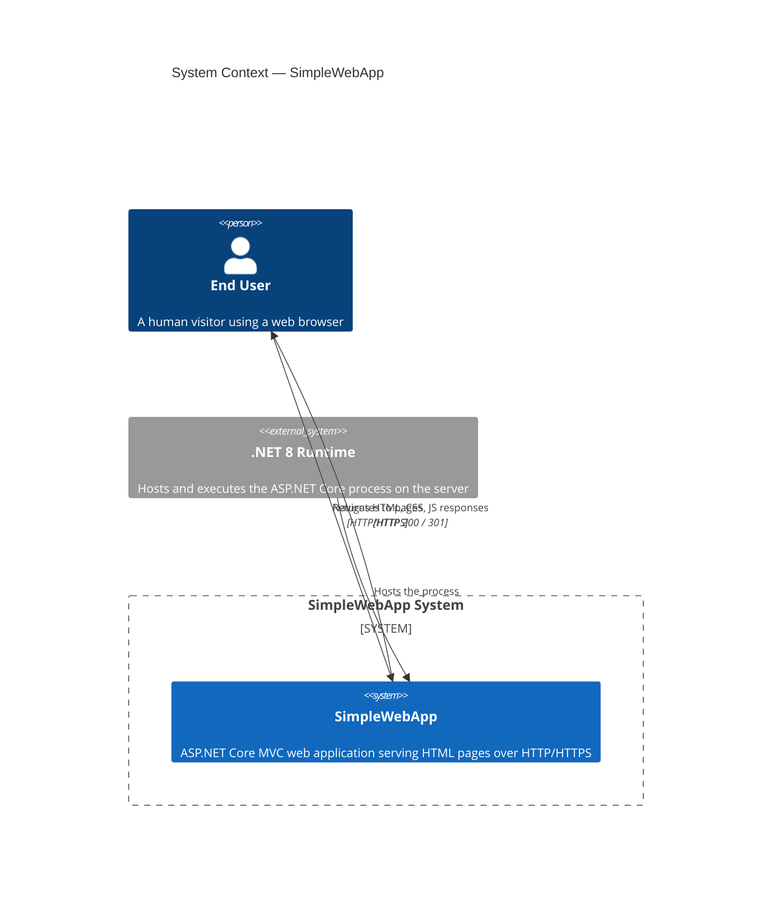

### 3.2 Technical Context

The diagram below shows the technical interfaces between the application and its runtime environment:

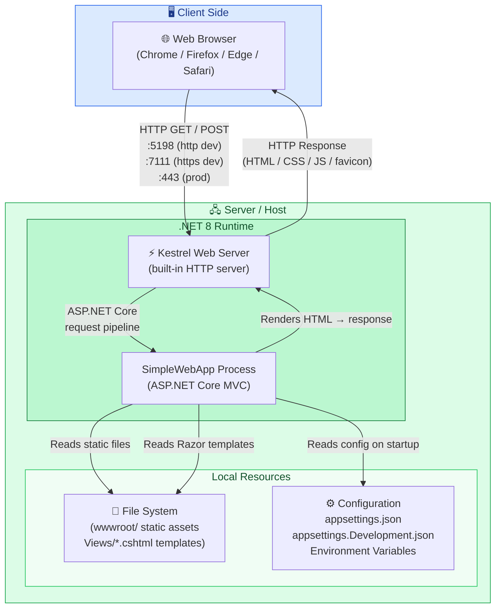

### 3.3 External Interfaces Summary

| Interface | Direction | Protocol | Notes |
|-----------|-----------|----------|-------|
| Browser ↔ App (HTTP) | Bidirectional | HTTP/1.1 | Port 5198 (dev), 32623 (IIS Express dev) |
| Browser ↔ App (HTTPS) | Bidirectional | TLS 1.2+ | Port 7111 (dev), 44377 (IIS Express dev), 443 (prod) |
| App → File System | Read | OS file I/O | Static files from `wwwroot/`; Razor views from `Views/` |
| App → Environment | Read | OS env vars | `ASPNETCORE_ENVIRONMENT` for environment detection |
| App → Config Files | Read | File I/O | `appsettings.json`, `appsettings.Development.json` |

---

## 4. Solution Strategy

### 4.1 Technology Decisions

| Decision | Choice | Rationale |
|---------|--------|-----------|
| **Runtime** | .NET 8.0 LTS | Long-term support, cross-platform, high performance Kestrel server |
| **Web framework** | ASP.NET Core MVC | Mature, convention-driven, well-documented; ideal for server-rendered HTML |
| **View engine** | Razor (`.cshtml`) | Type-safe C# templating, integrates with model binding and tag helpers |
| **CSS framework** | Bootstrap 5 (vendored) | Responsive layout with minimal custom CSS; zero CDN runtime dependency |
| **JavaScript** | jQuery 3 + jQuery Validation | Lightweight DOM interaction; unobtrusive validation bundle for forms |
| **Configuration** | JSON + Environment Variables | Follows twelve-factor app principles for externalised configuration |
| **Logging** | ASP.NET Core built-in `ILogger<T>` | Zero third-party dependency; structured, provider-agnostic logging |
| **Host model** | Generic Host (`IHostBuilder`) | Provides DI, configuration, logging, and graceful shutdown out-of-the-box |

### 4.2 Top-Level Decomposition Strategy

The application follows the **Model–View–Controller (MVC)** architectural pattern with a clear layered structure:

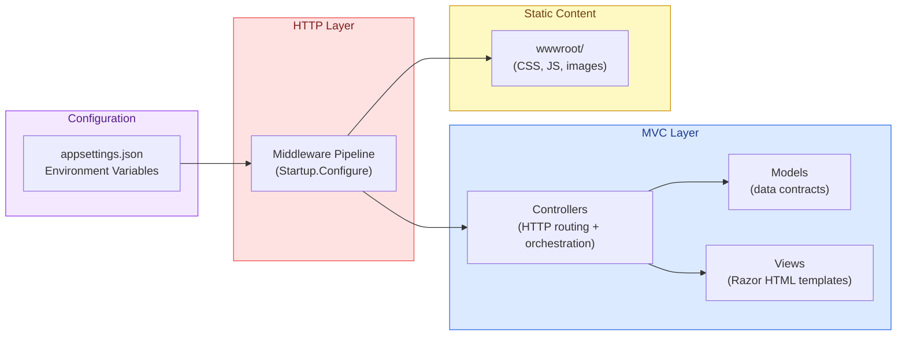

### 4.3 Approaches to Quality Goals

| Quality Goal | Approach |
|-------------|----------|
| **Simplicity** | Minimal surface area — one controller, one model, four views, zero external NuGet packages |
| **Maintainability** | Convention-based routing eliminates manual URL wiring; MVC pattern separates concerns |
| **Security** | `UseHttpsRedirection` + `UseHsts` in production; `UseDeveloperExceptionPage` restricted to Development |
| **Reliability** | Centralised `Error` action with `ErrorViewModel` captures diagnostics without leaking stack traces |
| **Portability** | `net8.0` TFM; Kestrel as default server; no OS-specific APIs used anywhere in the codebase |

---

## 5. Building Block View

### 5.1 Level 1 — High-Level System Decomposition

At the highest level, SimpleWebApp is a single deployable unit composed of four layers:

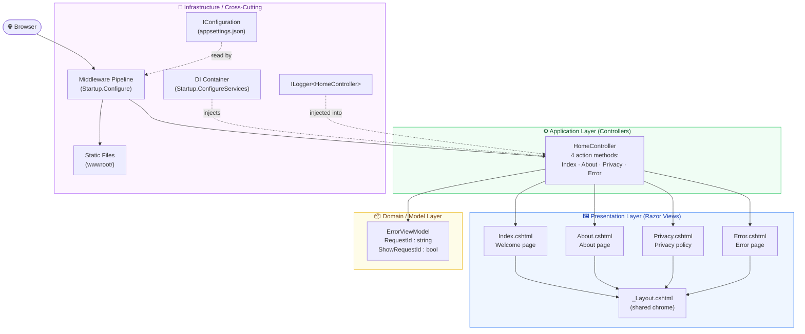

### 5.2 Level 2 — Package / Module Structure

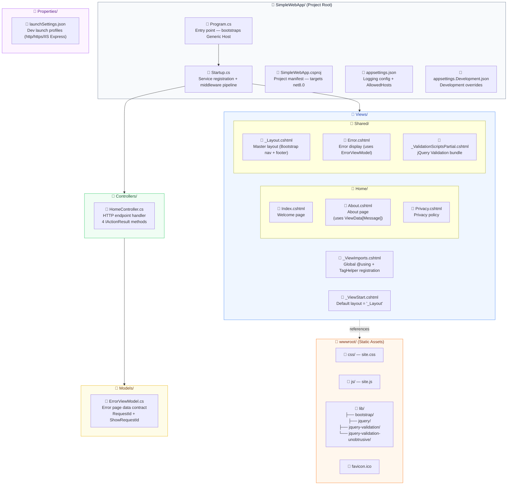

### 5.3 Level 3 — Detailed Class Structure

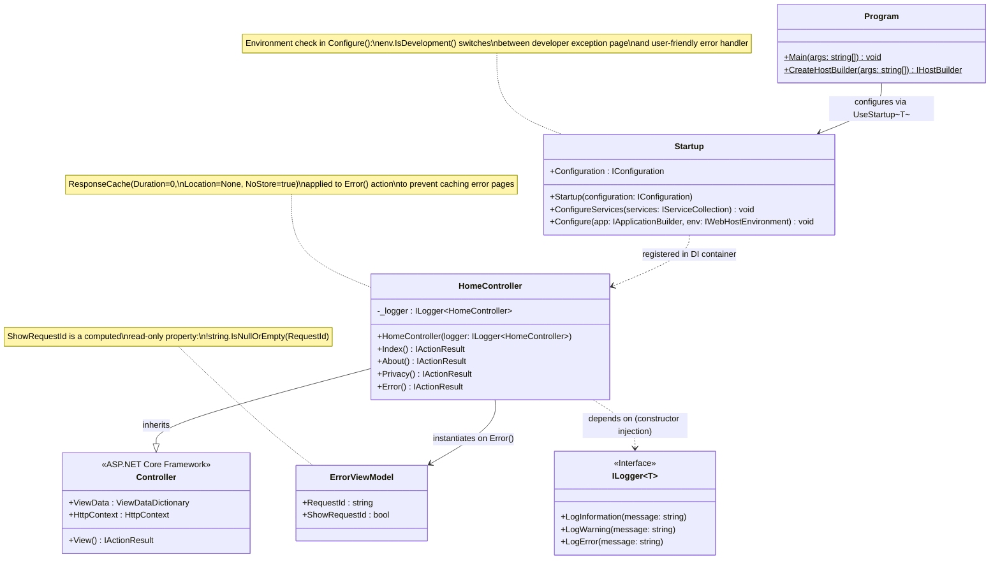

### 5.4 Middleware Pipeline (Ordered)

Order is critical in ASP.NET Core's middleware pipeline. The pipeline is assembled in `Startup.Configure`:

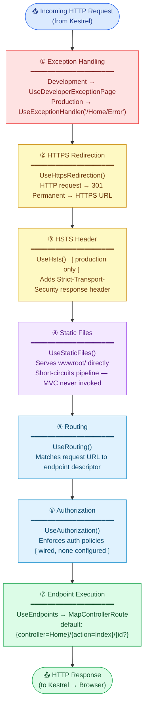

---

## 6. Runtime View

### 6.1 Scenario 1 — Successful Page Request (Happy Path)

The sequence below illustrates a user navigating to the **About** page (`GET /Home/About`):

```mermaid
sequenceDiagram
    actor User as 👤 User (Browser)
    participant Kestrel as Kestrel Web Server
    participant Pipeline as Middleware Pipeline
    participant Router as ASP.NET Core Router
    participant HC as HomeController
    participant Razor as Razor View Engine
    participant FS as File System (Views/)

    User->>Kestrel: GET /Home/About HTTP/1.1\nHost: localhost:7111
    Kestrel->>Pipeline: Forward request context

    Pipeline->>Pipeline: ① Exception handler — registers catch-all
    Pipeline->>Pipeline: ② HTTPS check — already HTTPS, passthrough
    Pipeline->>Pipeline: ③ HSTS — appends Strict-Transport-Security header
    Pipeline->>Pipeline: ④ Static files — /Home/About not in wwwroot/, passthrough

    Pipeline->>Router: ⑤ Route matching
    Router->>Router: Matches controller=Home, action=About
    Router->>Pipeline: ⑥ Authorization check — no policy, passes
    Pipeline->>HC: ⑦ Activate HomeController via DI

    Note over HC: ILogger&lt;HomeController&gt; injected by DI container
    HC->>HC: About() executes\nViewData["Message"] = "A simple .NET web application."
    HC->>Razor: return View() — triggers view lookup

    Razor->>FS: Load Views/Home/About.cshtml
    Razor->>FS: Load Views/Shared/_Layout.cshtml
    Razor->>Razor: Compile template + merge layout
    Razor->>Razor: Render HTML with ViewData values

    Razor-->>HC: Rendered HTML string (ViewResult)
    HC-->>Pipeline: IActionResult → HTTP 200 OK
    Pipeline-->>Kestrel: Response (text/html, ~4KB)
    Kestrel-->>User: HTTP 200 OK\nContent-Type: text/html; charset=utf-8
```

### 6.2 Scenario 2 — Static Asset Request

Static files are served directly by the `UseStaticFiles` middleware, bypassing the MVC stack entirely:

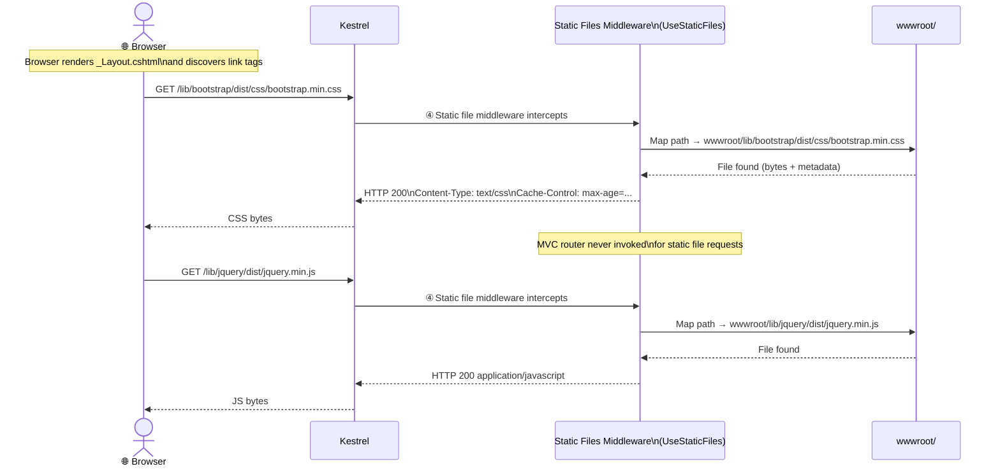

### 6.3 Scenario 3 — Unhandled Exception (Production)

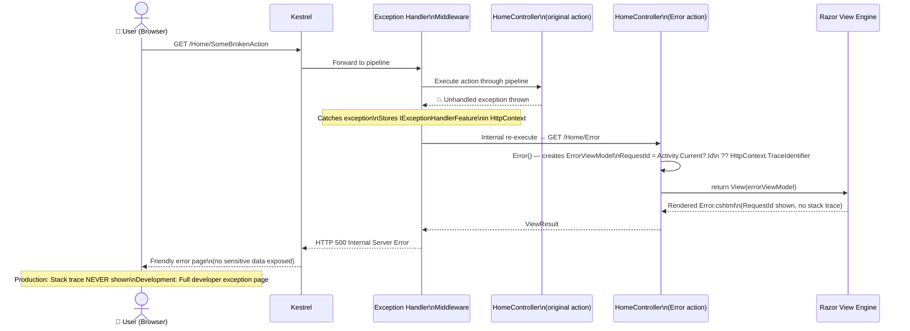

### 6.4 Scenario 4 — HTTP to HTTPS Redirect

```mermaid
sequenceDiagram
    actor User as 👤 User (Browser)
    participant Kestrel as Kestrel
    participant HTTPS as HTTPS Redirect\nMiddleware
    participant HSTS as HSTS Middleware
    participant App as Application\n(remaining pipeline)

    User->>Kestrel: GET http://example.com/ HTTP/1.1

    Kestrel->>HTTPS: ② HTTPS Redirect checks scheme
    HTTPS->>HTTPS: scheme == "http" → redirect needed
    HTTPS-->>Kestrel: 301 Moved Permanently\nLocation: https://example.com/
    Kestrel-->>User: HTTP 301 Redirect

    Note over User: Browser follows redirect automatically

    User->>Kestrel: GET https://example.com/ HTTP/1.1

    Kestrel->>HTTPS: ② HTTPS check — scheme == "https", passthrough
    HTTPS->>HSTS: ③ HSTS applies header
    HSTS->>HSTS: Append Strict-Transport-Security:\n  max-age=31536000; includeSubDomains
    HSTS->>App: Continue pipeline
    App-->>User: HTTP 200 OK with HSTS header
    Note over User: Browser will always use HTTPS\nfor this domain going forward
```

### 6.5 Application Startup Sequence

```mermaid
sequenceDiagram
    participant OS as Operating System
    participant CLR as .NET 8 CLR
    participant Main as Program.Main()
    participant HB as IHostBuilder\n(Generic Host)
    participant CFG as IConfiguration Builder
    participant SC as Startup.ConfigureServices()
    participant DIC as DI Container\n(IServiceCollection)
    participant Cfg2 as Startup.Configure()
    participant KS as Kestrel Web Server

    OS->>CLR: dotnet SimpleWebApp.dll [args]
    CLR->>Main: Execute Program.Main(args)

    Main->>HB: Host.CreateDefaultBuilder(args)

    HB->>CFG: Load appsettings.json
    HB->>CFG: Load appsettings.{Environment}.json
    HB->>CFG: Load environment variables
    HB->>CFG: Load command-line arguments
    CFG-->>HB: IConfiguration ready

    HB->>SC: Call Startup(IConfiguration) constructor
    HB->>SC: Call ConfigureServices(IServiceCollection)
    SC->>DIC: services.AddControllersWithViews()
    Note over DIC: Registers MVC services:\n• Controller activator\n• Razor view engine\n• Tag helpers\n• ILogger&lt;T&gt; (via default logging)\n• Model binders, validators
    SC-->>HB: Service registration complete

    HB->>DIC: Build IServiceProvider (container sealed)

    HB->>Cfg2: Call Configure(IApplicationBuilder, IWebHostEnvironment)
    Cfg2->>Cfg2: env.IsDevelopment() check
    Cfg2->>Cfg2: Compose 7-step middleware pipeline
    Cfg2-->>HB: Pipeline ready

    HB->>KS: ConfigureWebHostDefaults → Start Kestrel
    KS-->>OS: 🟢 Listening\n  http://localhost:5198\n  https://localhost:7111
```

---

## 7. Deployment View

### 7.1 Development Deployment

In development, the application runs directly on the developer's workstation:

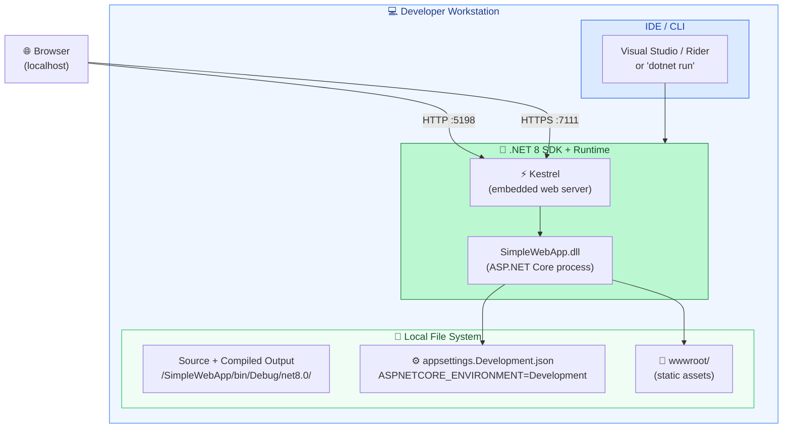

**Launch profiles** defined in `Properties/launchSettings.json`:

| Profile | Command | HTTP Port | HTTPS Port | Environment |
|---------|---------|-----------|------------|-------------|
| `http` | `dotnet run` | 5198 | — | Development |
| `https` | `dotnet run` | 5198 | 7111 | Development |
| `IIS Express` | IISExpress | 32623 | 44377 | Development |

### 7.2 Production Deployment (Recommended Topology)

For production, the recommended topology runs Kestrel **behind a reverse proxy** for TLS termination, load balancing, and security hardening:

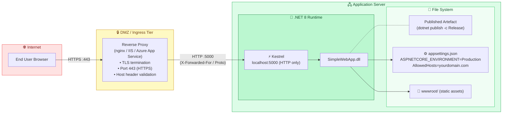

### 7.3 Container Deployment (Optional Path)

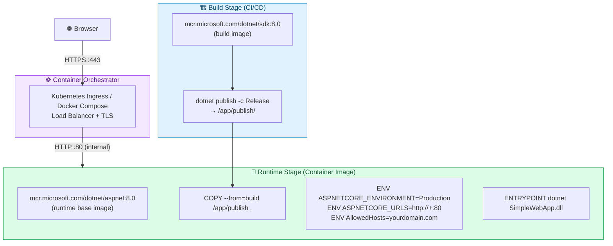

### 7.4 Build and Publish Pipeline

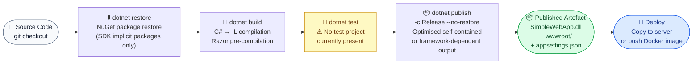

---

## 8. Crosscutting Concepts

### 8.1 Configuration Management

Configuration follows the ASP.NET Core **layered configuration** principle (later sources override earlier ones):

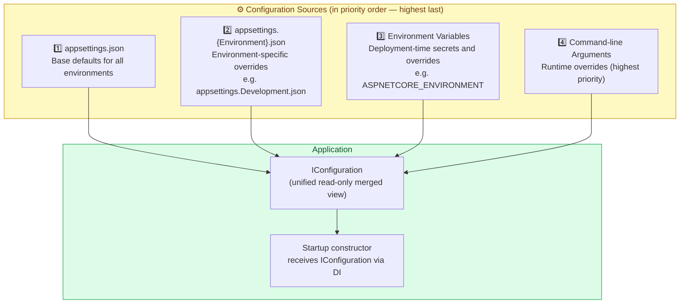

**Active configuration keys:**

| Key | Value (default) | Override in Prod |
|-----|----------------|-----------------|
| `Logging:LogLevel:Default` | `Information` | Consider `Warning` |
| `Logging:LogLevel:Microsoft.AspNetCore` | `Warning` | `Warning` or `Error` |
| `AllowedHosts` | `*` | Set to specific hostname(s) |

### 8.2 Logging Strategy

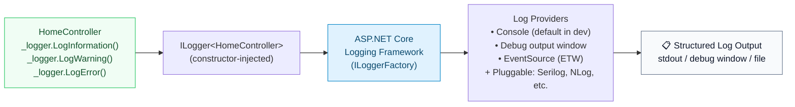

The `HomeController` receives `ILogger<HomeController>` via constructor injection. Log messages are automatically categorised under the fully-qualified class name `SimpleWebApp.Controllers.HomeController`, enabling fine-grained log-level control through configuration.

### 8.3 Error Handling Strategy

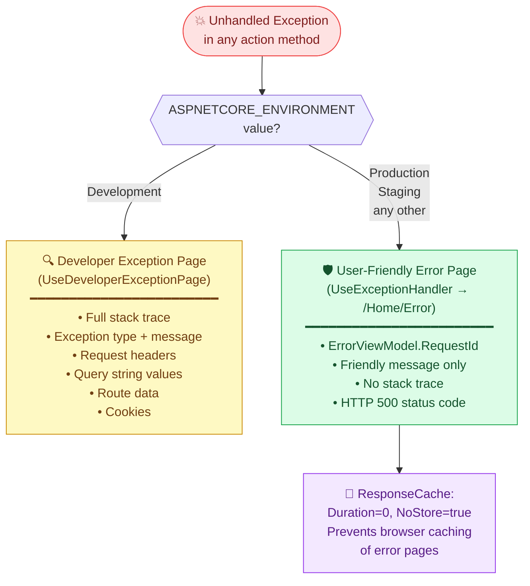

### 8.4 Security Concepts

| Concept | Implementation | File / Location |
|---------|---------------|----------------|
| **Transport Security** | `UseHttpsRedirection()` forces HTTP → HTTPS (301) | `Startup.Configure` |
| **HSTS** | `UseHsts()` adds `Strict-Transport-Security` header | `Startup.Configure` (production only) |
| **No sensitive data exposure** | Developer exception page gated to `IsDevelopment()` | `Startup.Configure` |
| **Anonymous access** | `WindowsAuthentication=false`, `AnonymousAuthentication=true` | `launchSettings.json` |
| **Authorization wired** | `UseAuthorization()` present but no `[Authorize]` policies | `Startup.Configure` |
| **Error response no-cache** | `[ResponseCache(NoStore=true)]` on `Error()` action | `HomeController.cs` |

### 8.5 Dependency Injection

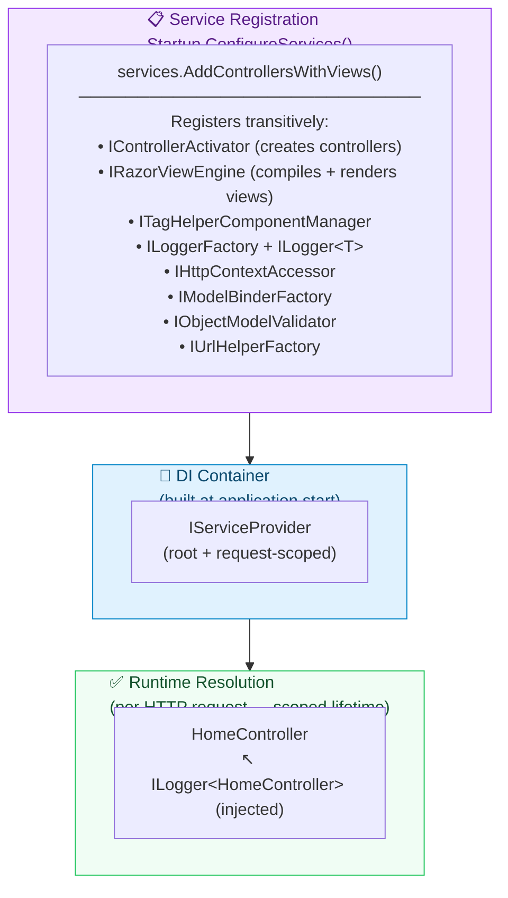

### 8.6 View Composition Model

```mermaid
graph TB
    subgraph ViewComposition["🖼️ Razor View Composition Model"]
        VS["_ViewStart.cshtml\nLayout = '_Layout'\n(applied to every view automatically)"]
        VI["_ViewImports.cshtml\n@using SimpleWebApp\n@using SimpleWebApp.Models\n@addTagHelper *, Microsoft.AspNetCore.Mvc.TagHelpers"]

        subgraph Layout["_Layout.cshtml (Master Template)"]
            NAV["Bootstrap Navbar\n(Home · About · Privacy links)"]
            BODY["@RenderBody() slot\n(child view content rendered here)"]
            FOOTER["Footer\n(copyright notice)"]
            SCRIPTS["@RenderSectionAsync('Scripts', required: false)\n(optional script section per view)"]
        end

        IV["Index.cshtml\n→ fills @RenderBody"]
        AV["About.cshtml\n→ fills @RenderBody\n+ uses ViewData['Message']"]
        PV["Privacy.cshtml\n→ fills @RenderBody"]
        EV["Error.cshtml\n→ fills @RenderBody\n+ @model ErrorViewModel"]

        VS -.->|"sets Layout for"| IV
        VS -.->|"sets Layout for"| AV
        VS -.->|"sets Layout for"| PV
        VS -.->|"sets Layout for"| EV
        VI -.->|"imports into"| IV
        VI -.->|"imports into"| AV
        VI -.->|"imports into"| PV
        VI -.->|"imports into"| EV

        IV --> BODY
        AV --> BODY
        PV --> BODY
        EV --> BODY
    end

    style ViewComposition fill:#eff6ff,stroke:#3b82f6,color:#1e40af
    style Layout fill:#dbeafe,stroke:#2563eb,color:#1e40af
```

---

## 9. Architecture Decisions

### ADR-001 — Use ASP.NET Core MVC over Minimal APIs

| Attribute | Value |
|-----------|-------|
| **Status** | Accepted |
| **Context** | .NET 6+ introduced Minimal APIs as a lightweight alternative to the MVC framework |

**Decision**: Use `AddControllersWithViews()` (full ASP.NET Core MVC).

**Rationale**:
- MVC provides first-class Razor view engine integration (`_Layout.cshtml`, Tag Helpers, `ViewData`)
- Convention-based controller discovery reduces boilerplate for multi-page applications
- Better separation of concerns for applications with multiple HTML pages
- Large ecosystem of tutorials and tooling support; familiar to most .NET developers

**Consequences**:
- Slightly heavier DI registration footprint than Minimal APIs
- Requires adherence to controller/action naming conventions for route discovery
- Clear extension points for Areas, Action Filters, and Model Binding when needed

---

### ADR-002 — Use Generic Host with Explicit `Startup` Class

| Attribute | Value |
|-----------|-------|
| **Status** | Accepted |
| **Context** | .NET 6 introduced `WebApplication.CreateBuilder()` as a newer, simpler hosting model |

**Decision**: Use `Host.CreateDefaultBuilder(args).ConfigureWebHostDefaults(b => b.UseStartup<Startup>())`.

**Rationale**:
- `Startup` class cleanly separates service registration (`ConfigureServices`) from pipeline configuration (`Configure`)
- `Startup` is independently testable — can be instantiated with a mock `IConfiguration`
- Familiar pattern for developers coming from ASP.NET Core 2.x–5.x codebases

**Consequences**:
- More boilerplate than `WebApplication.CreateBuilder()` / top-level statements
- Migration to the minimal hosting model is straightforward when desired (one-time refactor)

---

### ADR-003 — Vendor Frontend Libraries (No CDN)

| Attribute | Value |
|-----------|-------|
| **Status** | Accepted |
| **Context** | Bootstrap and jQuery can be loaded from a public CDN or vendored locally |

**Decision**: Vendor all frontend dependencies under `wwwroot/lib/`.

**Rationale**:
- No runtime CDN dependency; application serves consistently in offline/air-gapped environments
- Deterministic asset versions across all deployment environments
- No GDPR or privacy concerns from third-party CDN requests
- Consistent cache-busting via `asp-append-version` tag helper

**Consequences**:
- Repository size increases with vendored assets (Bootstrap, jQuery, jQuery Validation)
- Manual upgrade process required (LibMan CLI or file replacement)
- No passive CDN caching benefit for end users

---

### ADR-004 — Convention-Based Routing (Single Central Route)

| Attribute | Value |
|-----------|-------|
| **Status** | Accepted |
| **Context** | ASP.NET Core MVC supports both convention-based routing and per-action attribute routing |

**Decision**: Define a single conventional route: `{controller=Home}/{action=Index}/{id?}`.

**Rationale**:
- All URL→controller mappings are visible in one place (`Startup.Configure`)
- No per-action routing annotations needed, reducing clutter on action methods
- Appropriate for the uniform URL structure of a small informational website

**Consequences**:
- RESTful API endpoints or non-standard URL patterns require additional routes or attribute routing
- Convention-based routing is less discoverable for large codebases with many controllers

---

### ADR-005 — No Persistence Layer

| Attribute | Value |
|-----------|-------|
| **Status** | Accepted |
| **Context** | The application currently has no data storage requirements |

**Decision**: Omit any database, ORM, caching layer, or session state.

**Rationale**:
- YAGNI principle — no current business logic requires persistence
- Keeps the baseline clean with zero data-layer risk surface (SQL injection, connection management)
- Adding Entity Framework Core, Dapper, or Redis is straightforward when needed

**Consequences**:
- All pages render static content only
- Future persistence requires schema design, migration strategy, and DI registration
- No horizontal scaling concerns related to session stickiness

---

## 10. Quality Requirements

### 10.1 Quality Tree

```mermaid
mindmap
  root((Quality\nGoals))
    Simplicity
      Minimal LOC ~120 app lines
      Single controller
      Single model
      Zero external NuGet packages
    Maintainability
      Convention-based MVC structure
      Constructor injection throughout
      Clear separation of concerns
      Environment-specific config
    Security
      HTTPS enforcement via redirect
      HSTS header in production
      No stack traces to end users
      No hardcoded secrets
      Vendor-only frontend assets
    Reliability
      Centralised error handling
      Environment-aware middleware
      No-cache on error responses
      RequestId for diagnostics
    Portability
      net8.0 cross-platform TFM
      No Windows-only APIs
      Kestrel as default server
      Container-ready architecture
    Performance
      Static file short-circuit
      Browser-cached vendored assets
      Minimal middleware chain
      No unnecessary database calls
```

### 10.2 Quality Scenarios

| ID | Quality Attribute | Stimulus | Response Measure |
|----|-----------------|----------|-----------------|
| QS-1 | **Security** | User accesses app over plain HTTP | 100% of HTTP requests receive 301 redirect to HTTPS |
| QS-2 | **Security** | Exception thrown in production | Zero stack traces or sensitive details exposed to end user |
| QS-3 | **Reliability** | Unhandled exception in any action | Friendly error page renders with `RequestId`; HTTP 500 returned |
| QS-4 | **Performance** | Browser requests `bootstrap.min.css` | Static file served in < 10ms; MVC pipeline not invoked |
| QS-5 | **Maintainability** | Developer adds a new page/controller | Follows `{Name}Controller : Controller` convention; route auto-registered |
| QS-6 | **Portability** | Deploy on Linux server | Application starts and serves requests; zero platform-specific failures |
| QS-7 | **Simplicity** | New developer onboards | Full codebase understood within 30 minutes; no undocumented magic |

### 10.3 Code Quality Metrics

| Metric | Measured Value | Assessment |
|--------|---------------|------------|
| **Application LOC** | ~120 lines (excl. views, config, static assets) | ✅ Very lean |
| **Controller count** | 1 (`HomeController`) | ✅ Single responsibility |
| **Action methods** | 4 (Index, About, Privacy, Error) | ✅ Well within reasonable limits |
| **Model classes** | 1 (`ErrorViewModel`) | ✅ Minimal model surface |
| **Max cyclomatic complexity** | 2 (ternary in `ErrorViewModel.ShowRequestId`) | ✅ Trivially simple |
| **Constructor parameters** | 1 (`ILogger<HomeController>`) | ✅ Low coupling |
| **External NuGet dependencies** | 0 (implicit via `Microsoft.NET.Sdk.Web`) | ✅ Framework SDK only |
| **Unit test coverage** | 0% — no test project | ⚠️ Testing gap |
| **Integration test coverage** | 0% — no test project | ⚠️ Testing gap |
| **Dead code** | None detected | ✅ All code paths reachable |
| **Magic strings** | 1 (`"Message"` in `ViewData["Message"]`) | ⚠️ Minor — consider constant |

---

## 11. Risks and Technical Debt

### 11.1 Risk Register

| ID | Risk | Probability | Impact | Severity | Mitigation Strategy |
|----|------|:-----------:|:------:|:--------:|---------------------|
| R-1 | **No automated tests** | High | High | 🔴 Critical | Add `xUnit` + `Microsoft.AspNetCore.Mvc.Testing` for integration tests; unit test future business logic |
| R-2 | **`AllowedHosts: "*"` in production** | Medium | Medium | 🟠 Medium | Set to specific hostname(s) via `appsettings.Production.json` or environment variable |
| R-3 | **Vendored frontend libraries may become outdated** | Medium | Medium | 🟠 Medium | Introduce LibMan CLI or Dependabot to detect stale versions (Bootstrap, jQuery) |
| R-4 | **No health check endpoint** | Medium | Medium | 🟠 Medium | Add `services.AddHealthChecks()` + `endpoints.MapHealthChecks("/health")` |
| R-5 | **`UseAuthorization()` wired with no policies** | Low | Low | 🟡 Low | Document as intentional placeholder or remove until authentication is introduced |
| R-6 | **No Content-Security-Policy (CSP) header** | Medium | Medium | 🟠 Medium | Add CSP middleware or configure via reverse proxy / web.config |
| R-7 | **No response compression** | Low | Low | 🟡 Low | Add `AddResponseCompression()` + `UseResponseCompression()` for production efficiency |
| R-8 | **Copyright year hardcoded as `2020`** | High | Low | 🟡 Low | Replace with `@DateTime.Now.Year` in `_Layout.cshtml` footer |

### 11.2 Technical Debt Prioritisation

```mermaid
quadrantChart
    title Technical Debt — Business Impact vs Implementation Effort
    x-axis Low Effort --> High Effort
    y-axis Low Impact --> High Impact
    quadrant-1 Do First
    quadrant-2 Plan Carefully
    quadrant-3 Do Last
    quadrant-4 Re-evaluate

    Add unit tests: [0.50, 0.92]
    Add integration tests: [0.65, 0.88]
    Fix AllowedHosts: [0.10, 0.68]
    Add health checks: [0.20, 0.65]
    Add CSP headers: [0.30, 0.62]
    Upgrade frontend libs: [0.38, 0.52]
    Add response compression: [0.22, 0.38]
    Fix copyright year: [0.05, 0.08]
    Remove unused auth middleware: [0.08, 0.15]
    Add authentication: [0.88, 0.78]
```

### 11.3 Technical Debt Details

| ID | Debt Item | Category | Effort | Priority | Recommended Action |
|----|-----------|----------|:------:|:--------:|--------------------|
| TD-1 | No unit or integration tests | Testing | Medium | 🔴 High | Add `xUnit` project + `Microsoft.AspNetCore.Mvc.Testing` + `WebApplicationFactory<Program>` |
| TD-2 | `AllowedHosts: "*"` too permissive | Security | Trivial | 🟠 Medium | Set to specific domain via env var or `appsettings.Production.json` |
| TD-3 | Vendored Bootstrap/jQuery — no version tracking | Dependencies | Low | 🟠 Medium | Use `libman.json` (LibMan) or migrate to `package.json` + build tooling |
| TD-4 | No `/health` endpoint | Operability | Low | 🟠 Medium | `MapHealthChecks("/health")` enables load-balancer and container orchestrator probes |
| TD-5 | No structured logging / correlation IDs | Observability | Low | 🟡 Low | Add Serilog or structured logging enrichers; include `TraceIdentifier` in all log entries |
| TD-6 | No Content-Security-Policy header | Security | Medium | 🟠 Medium | Add middleware to set CSP, X-Frame-Options, X-Content-Type-Options headers |
| TD-7 | Copyright year `2020` hardcoded | Maintainability | Trivial | 🟡 Low | Replace `&copy; 2020` with `&copy; @DateTime.Now.Year` in `_Layout.cshtml` |
| TD-8 | No anti-forgery tokens on POST forms | Security | Low | 🟡 Low | When forms are introduced, add `@Html.AntiForgeryToken()` and `[ValidateAntiForgeryToken]` |
| TD-9 | No response compression | Performance | Low | 🟡 Low | Add `UseResponseCompression()` with Brotli/gzip to reduce transfer size |

---

## 12. Glossary

| Term | Definition |
|------|-----------|
| **Action Method** | A public method on an MVC controller that handles an HTTP request and returns an `IActionResult`. Examples: `Index()`, `About()`, `Error()`. |
| **Anti-Forgery Token** | A randomly generated security token embedded in HTML forms to prevent Cross-Site Request Forgery (CSRF) attacks. |
| **ASP.NET Core** | Microsoft's open-source, cross-platform web framework built on .NET for building web applications, APIs, and services. |
| **Bootstrap** | A popular open-source CSS/JavaScript UI framework providing responsive grid layouts, typography, navigation components, and pre-styled elements. |
| **C4 Model** | A hierarchical notation for software architecture diagrams (Context, Container, Component, Code) introduced by Simon Brown. |
| **Controller** | A C# class that inherits `Microsoft.AspNetCore.Mvc.Controller` and handles HTTP request routing, invokes business logic, and selects a view or response. |
| **Convention-Based Routing** | A routing strategy where URL patterns are mapped to controller/action pairs by naming convention defined centrally, rather than decorating each action with route attributes. |
| **CSP (Content-Security-Policy)** | An HTTP response header that instructs the browser which content sources (scripts, styles, images) are permitted, mitigating XSS attacks. |
| **DI (Dependency Injection)** | A design pattern in which an object's dependencies are provided by an external container (the DI container) rather than being instantiated internally. |
| **Generic Host** | The ASP.NET Core hosting abstraction (`IHostBuilder`) that provides built-in DI, configuration, logging, and application lifetime management. |
| **HSTS** | HTTP Strict Transport Security — an HTTP response header instructing browsers to only communicate with the server over HTTPS for a specified `max-age` duration. |
| **IActionResult** | The interface returned by MVC action methods. Common implementations: `ViewResult` (renders a Razor view), `RedirectResult`, `JsonResult`, `StatusCodeResult`. |
| **IConfiguration** | The ASP.NET Core abstraction for reading hierarchical configuration from multiple sources (JSON files, environment variables, command-line args). |
| **ILogger\<T\>** | The generic ASP.NET Core logging interface providing category-scoped log methods (`LogInformation`, `LogWarning`, `LogError`, etc.) injected via DI. |
| **Kestrel** | The built-in, cross-platform HTTP server for ASP.NET Core. Can be used standalone or behind a reverse proxy (nginx, IIS). |
| **LibMan** | The .NET Library Manager CLI tool for acquiring and managing client-side libraries (e.g., Bootstrap, jQuery) in ASP.NET Core projects. |
| **Middleware** | A component in the ASP.NET Core request pipeline that can inspect, modify, or short-circuit HTTP requests and responses. Composed in `Startup.Configure`. |
| **MVC** | Model–View–Controller — an architectural pattern that separates application concerns into three roles: data (Model), rendering (View), and request handling (Controller). |
| **Razor** | ASP.NET Core's server-side templating syntax that embeds C# expressions and code blocks within HTML files (`.cshtml` extension). |
| **RequestId** | A unique string identifier for an HTTP request, populated from `Activity.Current?.Id` or `HttpContext.TraceIdentifier`, used for correlating log entries with error reports. |
| **Reverse Proxy** | A server (e.g., nginx, IIS, Azure Application Gateway) that sits in front of the application server, handles TLS termination, and forwards requests to the backend. |
| **`Startup` class** | An ASP.NET Core convention class with two methods: `ConfigureServices` (registers DI services) and `Configure` (assembles the middleware pipeline). |
| **Static Files** | Assets (CSS, JavaScript, images, fonts) served directly from `wwwroot/` by the `UseStaticFiles` middleware, bypassing the MVC pipeline. |
| **Tag Helper** | Server-side Razor components that render HTML attributes or elements using C# logic. Examples: `asp-controller`, `asp-action`, `asp-append-version`. |
| **TFM (Target Framework Moniker)** | A standardised short string identifying the target .NET framework and version in project files. Example: `net8.0` = .NET 8.0. |
| **Vendored** | The practice of copying third-party library files directly into the source repository rather than fetching them at build time from a package registry. |
| **ViewData** | A `ViewDataDictionary` (dictionary of `string → object`) used to pass loosely-typed data from a controller action to its Razor view. |
| **WebApplicationFactory\<T\>** | An `Microsoft.AspNetCore.Mvc.Testing` class that bootstraps the full ASP.NET Core pipeline in memory for integration testing. |
| **wwwroot** | The conventional folder for static web assets in ASP.NET Core projects. Files placed here are directly accessible to browsers via the `UseStaticFiles` middleware. |
| **YAGNI** | "You Aren't Gonna Need It" — a software engineering principle advising against implementing features before they are required. |

---

*This Arc42 architecture documentation was generated by the **Arc42 Documentation Generator** based on static analysis of the `SimpleWebApp` source code.*  
*Source repository: `github.com/[org]/net` · Branch: `main` · Framework: `net8.0` · Last updated: 2025*
